.under {
  position: absolute;
  left: 0px;
  top: 0px;
  z-index: -1;
}

.over {
  position: absolute;
  left: 40px;
  top: 10px;
  z-index: -1;
}

 

 

 &nbsp; &nbsp; 

&nbsp;

&nbsp;

&nbsp;

&nbsp;

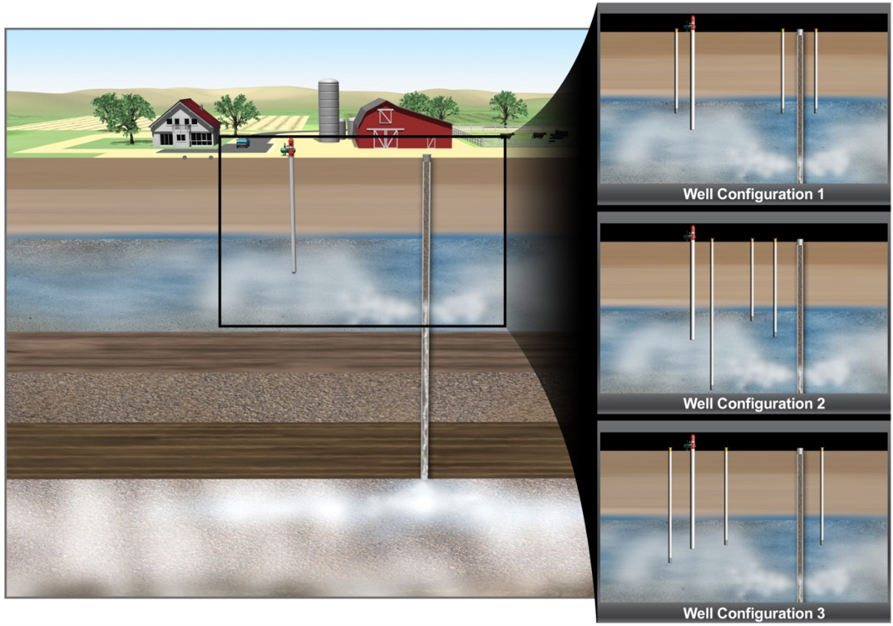

    
<strong>Designs for Risk Evaluation and Management (DREAM) Tool User Manual, Version: 2022.01</strong>

X August 2022

&nbsp;

&nbsp;

&nbsp;

&nbsp;

&nbsp;

<strong>&nbsp;</strong>

<strong>&nbsp;</strong>

<strong>&nbsp;</strong>

&nbsp; &nbsp; &nbsp; &nbsp; &nbsp; &nbsp; &nbsp; &nbsp; &nbsp; &nbsp; &nbsp; &nbsp; <strong>Office of Fossil Energy and Carbon Management</strong>

<strong>&nbsp; &nbsp; &nbsp; &nbsp; &nbsp; &nbsp; &nbsp; &nbsp; &nbsp; &nbsp; &nbsp; &nbsp; &nbsp; &nbsp; &nbsp; &nbsp; &nbsp; &nbsp; &nbsp;&nbsp;</strong>NRAP-TRS-III-001-2020

 &nbsp;

<strong>Disclaimer</strong>

This report was prepared as an account of work sponsored by an agency of the United States Government. Neither the United States Government nor any agency thereof, nor any of their employees, makes any warranty, express or implied, or assumes any legal liability or responsibility for the accuracy, completeness, or usefulness of any information, apparatus, product, or process disclosed, or represents that its use would not infringe privately owned rights. Reference therein to any specific commercial product, process, or service by trade name, trademark, manufacturer, or otherwise does not necessarily constitute or imply its endorsement, recommendation, or favoring by the United States Government or any agency thereof. The views and opinions of authors expressed therein do not necessarily state or reflect those of the United States Government or any agency thereof.

<strong>&nbsp;</strong>

<strong>Cover Illustration:</strong> A conceptual visualization of a DREAM application to a hypothetical leak from subsurface storage into an overlying aquifer through an abandoned wellbore. The inserts visualize three of many monitoring configurations that DREAM would generate and assess during the iterative procedure. &nbsp;

<strong>&nbsp;</strong>

<strong>Suggested Citation:</strong> Hanna, A.C.; Whiting, J.M.; Huang, B.Z.; Appriou, D. <em>Designs for Risk Evaluation and Management (DREAM) Tool User Manual, Version: 2022.01;</em> NRAP-TRS-III-001-2020; NRAP&nbsp;Technical Report Series;<em>&nbsp;</em>U.S. Department of Energy, National Energy Technology Laboratory:<em>&nbsp;</em>Morgantown, WV<em>,&nbsp;</em>2020; p 45.

&nbsp;

<strong>An electronic version of this report can be found at:&nbsp;</strong>

<a href="https://edx.netl.doe.gov/organization/nrap-tools/folder/080f6c7e-7a40-43c2-9c44-551bcc16ed7d"><strong>https://edx.netl.doe.gov/organization/nrap-tools/folder/080f6c7e-7a40-43c2-9c44-551bcc16ed7d</strong></a>

<strong>&nbsp;</strong>

<strong>&nbsp;</strong>

The data in this report can be accessed from NETL&apos;s Energy Data eXchange (EDX) online system (https://edx.netl.doe.gov) using the following link:

https://edx.netl.doe.gov/dataset/........

 &nbsp;

&nbsp;

<strong>Designs for Risk Evaluation and Management (DREAM) Tool User Manual, Version: 2022.01</strong>

<strong>&nbsp;</strong>

<strong>&nbsp;</strong>

<strong>Alexander C. Hanna1,&nbsp;</strong><strong>Jonathan M. Whiting1, Brian Z. Huang1, Delphine Appriou1</strong>

<strong>&nbsp;</strong>

    
<strong>1</strong><strong>Pacific Northwest National Laboratory,</strong>&nbsp;<strong>902 Battelle Boulevard,&nbsp;</strong><strong>Richland, WA 99354</strong>

    
<strong>&nbsp;</strong>

<strong>&nbsp;</strong>

<strong>NRAP-TRS-III-001-2020</strong>

X August 2022

&nbsp;

&nbsp;

&nbsp;

&nbsp;

Level III Technical Report Series

&nbsp;

&nbsp;

&nbsp;

&nbsp; &nbsp; &nbsp; &nbsp;NRAP Contacts:&nbsp;

XX, Principal Investigator

XX, Technical Portfolio Lead

XXX, Research &amp; Innovation Center

 

  <strong>Acronyms, Abbreviations, and Symbols</strong>

<table>
<tbody>
<tr>
<td width="109">

<strong>Term</strong>

</td>
<td width="433">

<strong>Description</strong>

</td>
</tr>
<tr>
<td colspan="2" width="542">

<strong><em>Acronyms/Abbreviations</em></strong>

</td>
</tr>
<tr>
<td width="109">

3D

</td>
<td width="433">

Three-dimensional

</td>
</tr>
<tr>
<td width="109">

ASCII

</td>
<td width="433">

American Standard Code for Information Interchange

</td>
</tr>
<tr>
<td width="109">

CO2

</td>
<td width="433">

Carbon dioxide

</td>
</tr>
<tr>
<td width="109">

DOE

</td>
<td width="433">

U.S. Department of Energy

</td>
</tr>
<tr>
<td width="109">

DREAM

</td>
<td width="433">

Designs for Risk Evaluation and Management

</td>
</tr>
<tr>
<td width="109">

EDX

</td>
<td width="433">

Energy Data Exchange

</td>
</tr>
<tr>
<td width="109">

GUI

</td>
<td width="433">

Graphical user interface

</td>
</tr>
<tr>
<td width="109">

HDF5

</td>
<td width="433">

Hierarchical data format

</td>
</tr>
<tr>
<td width="109">

IAM

</td>
<td width="433">

Integrated Assessment Model

</td>
</tr>
<tr>
<td width="109">

LANL

</td>
<td width="433">

Los Alamos National Laboratory

</td>
</tr>
<tr>
<td width="109">

LBNL

</td>
<td width="433">

Lawrence Berkeley National Laboratory

</td>
</tr>
<tr>
<td width="109">

LLNL

</td>
<td width="433">

Lawrence Livermore National Laboratory

</td>
</tr>
<tr>
<td width="109">

NETL

</td>
<td width="433">

National Energy Technology Laboratory

</td>
</tr>
<tr>
<td width="109">

NRAP

</td>
<td width="433">

National Risk Assessment Partnership

</td>
</tr>
<tr>
<td width="109">

NUFT

</td>
<td width="433">

Nonisothermal, Unsaturated Flow and Transport model

</td>
</tr>
<tr>
<td width="109">

PC

</td>
<td width="433">

Personal computer

</td>
</tr>
<tr>
<td width="109">

PNNL

</td>
<td width="433">

Pacific Northwest National Laboratory

</td>
</tr>
<tr>
<td width="109">

RCSP

</td>
<td width="433">

Regional Carbon Sequestration Partnership

</td>
</tr>
<tr>
<td width="109">

STOMP

</td>
<td width="433">

Subsurface Transport Over Multiple Phases model

</td>
</tr>
<tr>
<td width="109">

TTD

</td>
<td width="433">

Time to detection

</td>
</tr>
<tr>
<td width="109">

USDW

</td>
<td width="433">

Underground source of drinking water

</td>
</tr>
<tr>
<td width="109">

VAD

</td>
<td width="433">

Volume of aquifer degraded

</td>
</tr>
<tr>
<td colspan="2" width="542">

<strong><em>Units/Symbols</em></strong>

</td>
</tr>
<tr>
<td width="109">

cm

</td>
<td width="433">

centimeter

</td>
</tr>
<tr>
<td width="109">

L

</td>
<td width="433">

Liter

</td>
</tr>
<tr>
<td width="109">

mg

</td>
<td width="433">

Milligram

</td>
</tr>
<tr>
<td width="109">

mg/L

</td>
<td width="433">

Milligrams per liter

</td>
</tr>
<tr>
<td width="109">

min

</td>
<td width="433">

Minute

</td>
</tr>
<tr>
<td width="109">

mol

</td>
<td width="433">

Mole

</td>
</tr>
<tr>
<td width="109">

Pa

</td>
<td width="433">

Pascal

</td>
</tr>
<tr>
<td width="109">

yr

</td>
<td width="433">

Year

</td>
</tr>
<tr>
<td width="109">

Gal

</td>
<td width="433">

Galileo

</td>
</tr>
</tbody>
</table>

&nbsp;

<!-- Acknowledgements -->

<h1 style="margin-top:0in;margin-right:0in;margin-bottom:9.6pt;margin-left:0in;">Acknowledgments</h1>

This work was completed as part of the National Risk Assessment Partnership (NRAP) project. Support for this project came from the U.S. Department of Energy&rsquo;s (DOE) Office of Fossil Energy&rsquo;s Crosscutting Research program.<a href="#_msocom_1" id="_anchor_1" language="JavaScript" name="_msoanchor_1">[AD1]</a>&nbsp; The authors wish to acknowledge Mark McKoy (NETL Office of Science and Technology Strategic Plans and Programs), Darin Damiani (Carbon Storage Project Manager, and Mark Ackiewicz (Director of Division of Carbon Capture and Storage, DOE Office of Fossil Energy) for programmatic guidance, direction, and support. This work was supported by the Assistant Secretary for Fossil Energy, Office of Sequestration, Hydrogen, and Clean Coal Fuels, for the National Risk Assessment Partnership (NRAP) project managed by the National Energy Technology Laboratory (NETL). This work was performed under the auspices of the U.S. DOE by Pacific Northwest National Laboratory, operated by Battelle for the U.S. DOE under Contract DE-AC05-76RLO1830. &nbsp;Work at Lawrence Berkeley National Laboratory was completed under the U.S. DOE Contract No. DE-AC02-05CH1123. Work at Los Alamos National Laboratory was supported under the U.S. DOE Contract No. 89233218CNA000001.&nbsp;Work at&nbsp;Lawrence Livermore National Laboratory was supported under the U.S. DOE Contract No. <a href="https://www.sciencedirect.com/science/article/pii/S175058362200007X#gs00004">DE-AC52-07NA27344</a> . Work at Los Alamos National Laboratory was supported under the U.S. DOE Contract No. <a href="https://www.sciencedirect.com/science/article/pii/S175058362200007X#gs00002">89233218CNA000001</a>.&nbsp;

 

      
      
      
      
<!-- Abstract -->
      
<h1 style="margin-top:0in;margin-right:0in;margin-bottom:9.6pt;margin-left:0in;">ABSTRACT</h1>

This user manual provides a brief guide for use of the <em>Designs for Risk Evaluation and Management</em> (<em>DREAM</em>) tool Version 3.0, developed as part of the effort to quantify the risk of geologic storage of carbon dioxide (CO2) under the U.S. Department of Energy&rsquo;s (DOE) National Risk Assessment Partnership (NRAP). DREAM is an optimization tool created to identify optimal monitoring schemes that minimize the time to first detection of unintended CO2 leakage from a subsurface storage formation. This user manual illustrates the program and graphical user interface (GUI), provides guidance on how to define the inputs required, and includes an example application for the user to follow.

DREAM optimizes across user-provided outputs from subsurface leakage simulations or uses outputs from reduced order models (ROM). While DREAM was developed for CO2 leakage scenarios, it is applicable to any subsurface leakage simulation of the same output format.

The DREAM tool is comprised of the four main components that are consecutively listed:

(1) a Java wizard used to configure and execute the simulations,

(2) a visualization tool to view the domain space and optimization results,

(3) plotting outputs to visually analyze the results,

(4) a Java application to aid users in converting common American Standard Code for Information Interchange (ASCII) output data to the standard DREAM hierarchical data format (HDF5).

DREAM optimizes across user-provided subsurface leakage simulations based on user-specified leak parameters, factoring multiple objectives including minimizing cost, the earliest time to detection, and the volume of aquifer degraded. Currently, DREAM employs multi-objective optimization schemes that the user can select, including (i) Monte Carlo, (ii) Simulated Annealing, and (iii) Heuristic algorithm. The optimization schemes (i)-(iii) search for the optimal monitoring campaigns that minimize the tradeoff between the objectives, such as time to detection versus cost. One such approach, simulated annealing, searches the solution space by iteratively mutating potential monitoring schemes built off various configurations of monitoring locations and leak detection parameters. &nbsp;This approach has proven to be orders of magnitude faster than an exhaustive search of the entire solution space (Yonkofski et al., 2016).&nbsp;

    

 

<!-- Introduction -->

<h1>1.&nbsp;&nbsp;&nbsp;&nbsp; Introduction</h1>

The <em>Designs for Risk Evaluation and Management</em> (<em>DREAM</em>) tool was developed at Pacific Northwest National Laboratory (PNNL) to guide the optimal placement of monitoring devices to detect carbon dioxide (CO2) leakage from storage formations. The National Risk Assessment Partnership (NRAP) identified the need for a user-friendly tool with the ability to design site-specific, risk-based monitoring strategies. NRAP is&nbsp;a U.S. Department of Energy (DOE) project tasked with conducting risk and uncertainty analysis in the areas of reservoir performance, natural leakage pathways, wellbore integrity, groundwater protection, monitoring, and systems level modeling. Monitoring designs produced by DREAM may be&nbsp;used by stakeholders and regulators to assist in compliance with regulatory requirements developed to ensure the safety of U.S. underground sources of drinking water (USDW) and ultimately lead to safe, permanent geologic CO2 storage. Further, site-specific designs generated by DREAM allow for&nbsp;potential generalizations to other sites, as well as comparisons between risk-based monitoring designs and monitoring designs for other purposes, if such designs should already exist (e.g., from a Regional Carbon Sequestration Partnership [RCSP] site).

DREAM optimizes across user-provided subsurface leakage simulations based on user-specified leak parameters, factoring multiple objectives including minimizing cost, the earliest time to detection, or the volume of aquifer degraded. Currently, DREAM employs multi-objective optimization schemes that the user can select, including (i) Monte Carlo, (ii) Simulated Annealing, and (iii) Heuristic algorithm. The optimization schemes (i)-(iii) search for the optimal monitoring campaigns that minimize the tradeoff between the objectives, such as time to detection versus cost. The default simulated annealing algorithm has proven to be orders of magnitude faster than an exhaustive search of the entire solution space, e.g., Grid Search (Yonkofski et al., 2016), and newer algorithms may prove to be even more efficient. Leak parameters may include pressure, temperature, gas saturation, dissolved component concentrations, pH, or any other quantity that can be modeled in a physics-based simulation of porous media fluid transport. DREAM allows for a mix of monitoring technologies including point sensors and surface measurements. While DREAM was designed with applications to CO2 leakage in mind, this flexibility allows DREAM to determine optimal monitoring locations for any contaminant transport scenario.

Successful use of this software requires a rudimentary understanding of the leak scenarios, domain space, DREAM constraints, and the available optimization algorithms. There is rarely a definitively &ldquo;best&rdquo; monitoring solution, so DREAM instead functions as a support tool to highlight the opportunity trade-offs between good monitoring configurations. DREAM is limited by the spatial and temporal resolution of the subsurface leakage simulations, so decision-makers will need to translate DREAM configurations to real-world monitoring configurations that factor in site-specific constraints at a finer level. Decision-makers should always ground truth DREAM results to operational principles.

Development of DREAM began in 2012 as part of the NRAP project, with the first code version being released in 2016, and the second major version released in 2020. The current version has been under development since then, and its release marks an important step in the completion of the second phase of the NRAP program. Subsequent versions are intended to add new objectives, monitoring technologies, algorithms, and input formats, while making continual improvements to user interface, post-processing analysis, and computational speeds.

This manual illustrates the program GUI and describes the tool inputs and outputs,&nbsp;&nbsp;and how to interpret the results. For a synopsis of the theoretical basis of DREAM, see Yonkofski et al. (2016). For an example application using point source monitoring technologies from leakage simulations, see Yonkofski et al. (2017). For a combined application, see Bacon et al. (2019) for an example using NRAP-Open-IAM and DREAM to define a risk-based Post-Injection Site Care period and determine an optimized monitoring network for a commercial-scale CO2 storage project.

 

<!-- Software Installation and Requirements -->

<h1>2.&nbsp;&nbsp;&nbsp;&nbsp; Software Installation and Requirements</h1>

DREAM has three software dependencies that will support the effective use of the tool: Java, Python and HDF5 viewer.

        </ol>
        

        
<strong>Java &ndash; Required</strong>

        
DREAM is coded almost exclusively in Java. Users must have the most recent release of the Java Platform, which is currently compatible with Version 8. If Java is already installed, a search for &ldquo;About Java&rdquo; will help find the current version on your local machine. The latest version of Java SE can be downloaded at the following link:

        
<a href="https://www.oracle.com/java/technologies/downloads/#java8">https://www.oracle.com/java/technologies/downloads/#java8</a>

        
Note that you might have to create an account with Oracle before you can download the latest version of Java.

        
<strong>Python 3 &ndash; Optional (strongly recommended)</strong>

        
The core DREAM functions will run without Python, but most of the post-processing scripts that provide valuable insights from results are created with Python. If you already have Python installed, you can check your version by typing &ldquo;python --version&rdquo; into a command prompt. You can download the latest version of Python 3 at the following link:

        
<a href="https://www.python.org/downloads/">https://www.python.org/downloads/</a>

        
Python packages can also be installed by typing &ldquo;python -m pip install &lt;name&gt;&rdquo; into a command prompt. It is highly recommended to create a dedicated Python (or conda) environment for DREAM that will host compatible versions of the following required packages:

        <ul style="list-style-type: disc;margin-left:0.25in;">
            <li>numpy</li>
            <li>scipy</li>
            <li>h5py</li>
            <li>matplotlib</li>
            <li>pandas&nbsp;</li>
            <li><strong>HDF5 Viewer &ndash; Optional</strong></li>
        </ul>
        

        
DREAM converts raw leak simulation outputs into HDF5 files, a hierarchical data format that is designed to store and organize large amounts of data. The data can be explored with the <em>h5py</em> Python package that was mentioned earlier or with a packaged HDF5 viewer. DREAM developers recommend either installing HDFView or Panoply. The first application allows for simple viewing and editing of HDF5 files, while the second application allows for simple viewing and plotting. The viewers can be downloaded at the following links:

        
HDFView: <a href="https://www.hdfgroup.org/downloads/hdfview/">https://www.hdfgroup.org/downloads/hdfview/</a>

        
Panoply: <a href="https://www.giss.nasa.gov/tools/panoply/download/">https://www.giss.nasa.gov/tools/panoply/download/</a>

        
The current release of DREAM is made available on the NETL Energy Data Exchange (EDX) at XXXXX and includes a zip file with the following files:

        <ul style="list-style-type: disc;margin-left:0.25in;">
            <li><strong>A runnable JAR file</strong>, which packages all the necessary libraries, images, and documentation into an executable program.</li>
            <li><strong>Test Datasets</strong>&nbsp;that can be used by users to get familiar with the tool:
                <ol style="list-style-type: circle;">
                    <li><u>NRAP-OpenIAM Open Wellbore, Kimberlina site</u>&nbsp;
                        <ul class="decimal_type" style="list-style-type: square;">
                            <li>About the dataset: This dataset contains all the files&nbsp;associated with the analysis of leakage risks at a brownfield site (i.e., Kimberlina site), using NRAP-Open-IAM.&nbsp;</li>
                            <li>Access: <a href="https://edx.netl.doe.gov/dataset/application-of-nrap-open-iam-to-the-kimberlina-site">https://edx.netl.doe.gov/dataset/application-of-nrap-open-iam-to-the-kimberlina-site</a></li>
                            <li>Reference: Lackey G, VS Vasylkivska, NJ Huerta, S King, and RM Dilmore. 2019. &ldquo;Managing well leakage risks at a geologic carbon storage site with many wells.&rdquo; International Journal of Greenhouse Gas Control 88:182-194. 10.1016/j.ijggc.2019.06.011.</li>
                        </ul>
                    </li>
                    <li><u>NRAP-OpenIAM Reservoir model<ins cite="mailto:Delphine%20Appriou" datetime="2022-03-16T16:16">:</ins></u></li>
                </ol>
            </li>
            <li><ins cite="mailto:Delphine%20Appriou" datetime="2022-03-16T16:22">Provide description</ins><ins cite="mailto:Delphine%20Appriou" datetime="2022-03-16T16:31">:</ins>&nbsp;</li>
        </ul>
        

        <ol style="list-style-type: circle;">
            <li><u>HDF5 files based on NUFT Simulations, Kimberlina 1.2 site</u></li>
            <li><ins cite="mailto:Delphine%20Appriou" datetime="2022-03-16T16:29">About the dataset:&nbsp;</ins><ins cite="mailto:Kupis,%20Shyla" datetime="2022-07-01T08:48">Nonisothermal, Unsaturated Flow and Transport model</ins><ins cite="mailto:Kupis,%20Shyla" datetime="2022-07-01T08:50">, referred to as&nbsp;</ins><ins cite="mailto:Kupis,%20Shyla" datetime="2022-07-01T08:48">NUFT</ins><ins cite="mailto:Kupis,%20Shyla" datetime="2022-07-01T08:50">, was developed by Los Alamos National Laboratory (LLNL) to&nbsp;</ins><ins cite="mailto:Kupis,%20Shyla" datetime="2022-07-01T09:15">numerically&nbsp;</ins><ins cite="mailto:Kupis,%20Shyla" datetime="2022-07-01T08:50">model</ins><ins cite="mailto:Kupis,%20Shyla" datetime="2022-07-01T08:51">&nbsp;multi-phase non-isothermal flow and transport</ins><ins cite="mailto:Kupis,%20Shyla" datetime="2022-07-01T08:52">&nbsp;for 3d simulations</ins><ins cite="mailto:Kupis,%20Shyla" datetime="2022-07-01T08:54">&nbsp;of</ins><ins cite="mailto:Kupis,%20Shyla" datetime="2022-07-01T08:58">&nbsp;</ins><ins cite="mailto:Kupis,%20Shyla" datetime="2022-07-01T09:01">either the</ins><ins cite="mailto:Kupis,%20Shyla" datetime="2022-07-01T08:54">&nbsp;saturated&nbsp;</ins><ins cite="mailto:Kupis,%20Shyla" datetime="2022-07-01T09:01">zone&nbsp;</ins><ins cite="mailto:Kupis,%20Shyla" datetime="2022-07-01T08:54">or unsaturated&nbsp;</ins><ins cite="mailto:Kupis,%20Shyla" datetime="2022-07-01T08:59">zone</ins><ins cite="mailto:Kupis,%20Shyla" datetime="2022-07-01T08:52">.&nbsp;</ins><ins cite="mailto:Kupis,%20Shyla" datetime="2022-07-01T09:01">U</ins><ins cite="mailto:Kupis,%20Shyla" datetime="2022-07-01T08:52">ser</ins><ins cite="mailto:Kupis,%20Shyla" datetime="2022-07-01T09:01">s</ins><ins cite="mailto:Kupis,%20Shyla" datetime="2022-07-01T08:52">&nbsp;</ins><ins cite="mailto:Kupis,%20Shyla" datetime="2022-07-01T08:54">can&nbsp;</ins><ins cite="mailto:Kupis,%20Shyla" datetime="2022-07-01T09:02">analyze</ins><ins cite="mailto:Kupis,%20Shyla" datetime="2022-07-01T08:59">&nbsp;the</ins><ins cite="mailto:Kupis,%20Shyla" datetime="2022-07-01T09:01">ir</ins><ins cite="mailto:Kupis,%20Shyla" datetime="2022-07-01T08:59">&nbsp;site</ins><ins cite="mailto:Kupis,%20Shyla" datetime="2022-07-01T09:01">s</ins><ins cite="mailto:Kupis,%20Shyla" datetime="2022-07-01T08:59">&nbsp;of interest</ins><ins cite="mailto:Kupis,%20Shyla" datetime="2022-07-01T10:01">&nbsp;for any leakage scenario</ins><ins cite="mailto:Kupis,%20Shyla" datetime="2022-07-01T08:59">&nbsp;</ins><ins cite="mailto:Kupis,%20Shyla" datetime="2022-07-01T09:02">using NUFT,&nbsp;</ins><ins cite="mailto:Kupis,%20Shyla" datetime="2022-07-01T09:01">and then</ins><ins cite="mailto:Kupis,%20Shyla" datetime="2022-07-01T09:03">&nbsp;they can</ins><ins cite="mailto:Kupis,%20Shyla" datetime="2022-07-01T09:01">&nbsp;us</ins><ins cite="mailto:Kupis,%20Shyla" datetime="2022-07-01T09:02">e these simulations as the inputs (e.g., hdf5 files) to run</ins><ins cite="mailto:Kupis,%20Shyla" datetime="2022-07-01T08:54">&nbsp;</ins><ins cite="mailto:Kupis,%20Shyla" datetime="2022-07-01T08:59">DREAM</ins><ins cite="mailto:Kupis,%20Shyla" datetime="2022-07-01T09:02">.</ins><ins cite="mailto:Kupis,%20Shyla" datetime="2022-07-01T08:51">&nbsp;</ins></li>
        </ol>
        

        <ul style="list-style-type: square;">
            <li><ins cite="mailto:Delphine%20Appriou" datetime="2022-03-16T16:29">&nbsp;</ins></li>
            <li><ins cite="mailto:Delphine%20Appriou" datetime="2022-03-16T16:29">Access:</ins><ins cite="mailto:Delphine%20Appriou" datetime="2022-03-16T16:31">https://edx.netl.doe.gov/dataset/llnl-kimberlina-1-2-nuft-simulations-june-2018-v2</ins><ins cite="mailto:Delphine%20Appriou" datetime="2022-03-16T16:33"></ins></li>
            <li><ins cite="mailto:Delphine%20Appriou" datetime="2022-03-16T16:29">Reference</ins><ins cite="mailto:Delphine%20Appriou" datetime="2022-03-16T16:46">s</ins><ins cite="mailto:Delphine%20Appriou" datetime="2022-03-16T16:29">:</ins><ins cite="mailto:Delphine%20Appriou" datetime="2022-03-16T16:30">&nbsp;</ins>
                <ul style="list-style-type: disc;">
                    <li><ins cite="mailto:Delphine%20Appriou" datetime="2022-03-16T16:30">Kayyum Mansoor, Thomas A. Buscheck, Xianjin Yang, Susan A. Carroll, Xiao Chen. LLNL Kimberlina 1.2 NUFT Simulations June 2018, 2018-06-25, https://edx.netl.doe.gov/dataset/llnl-kimberlina-1-2-nuft-simulations-june-2018, DOI: 10.18141/1603336</ins></li>
                    <li><ins cite="mailto:Delphine%20Appriou" datetime="2022-03-16T16:47">Yang, X., T. A. Buscheck, K. Mansoor, Z. Wang, K. Gao, L. Huang, D. Appriou, and S. A. Carroll (2019), Assessment of geophysical monitoring methods for detection of brine and CO2 leakage in drinking water aquifers, Int J Greenh Gas Con, 90, 102803.</ins></li>
                </ul>
            </li>
            <li><u>&nbsp;</u></li>
        </ul>
        

        <ol style="list-style-type: circle;">
            <li><u>HDF5 files based on NUFT Simulations, Kimberlina 1.2 site (relocated, i.e., the leakage origin points are artificially randomized)</u>&nbsp;</li>
            <li><ins cite="mailto:Delphine%20Appriou" datetime="2022-03-16T16:23">Provide description</ins></li>
        </ol>
        

        <ol style="list-style-type: circle;">
            <li><u>For more information on pre-processing data to run DREAM, please refer to Section&nbsp;</u><u>4</u><u>. This section will discuss the applications that can produce suitable data files needed to run DREAM, such as STOMP, NUFT, IAM, and TECPLOT. &nbsp;&nbsp;</u></li>
            <li>Examples of finished results to compare outputs to</li>
            <li><ins cite="mailto:Delphine%20Appriou" datetime="2022-03-16T16:24">Provide list</ins></li>
            <li>For any questions or feedback, please email <a href="mailto:alexander.hanna@pnnl.gov">alexander.hanna@pnnl.gov</a></li>
        </ol>
    </li>
</ol>

 

<!-- User Interface Walkthrough -->

<h1>3.&nbsp;&nbsp;&nbsp;&nbsp; User Interface Walkthrough</h1>

The DREAM tool is comprised of the four main components that are consecutively listed:

(1) a Java wizard used to configure and execute the simulations,

(2) a visualization tool to view the domain space and optimization results,&nbsp;

(3) plotting scripts used to analyze the results, &nbsp;

(4) a Java application to aid users in converting common American Standard Code for Information Interchange (ASCII) output data to the standard DREAM hierarchical data format (HDF5).

The example presented in this user manual is based on the test dataset from the brownfield site at Kimberlina Site, California, which is called Kimberlina 1.2. The data files are based on NUFT simulations at the Kimberlina site to model reactive multi-phase flow and transport of CO2 and brine for a case study of geologic carbon storage. In this tutorial, the user will be guided through the DREAM Java Wizard GUI while demonstrating an application to 19 randomly selected leakage scenarios generated for an NRAP Second-Generation Reduced-Order Model study (Carroll et al., 2014b). For context, a summary of the model set up from Carroll et al. (2014b) is provided below. 

The Nonisothermal, Unsaturated Flow and Transport <ins cite="mailto:Kupis,%20Shyla" datetime="2022-07-01T09:15">(</ins>NUFT<ins cite="mailto:Kupis,%20Shyla" datetime="2022-07-01T09:15">)</ins> numerical model&nbsp;for an alluvium case study of CO2 storage (Figure 1) from the Kimberlina 1.2 site is comprised of a 3D heterogeneous domain that is represented as an unconsolidated aquifer consisting of permeable sand layers and impermeable shale layers that are based on the lithology of the High Plains Aquifer. The aquifer is underlain by a hypothetical CO2 storage reservoir, and both aquifer and reservoir are penetrated by leaking wells. The model domain encompasses 10 km &times; 5 km &times; 240 m with 1 to 5 leakage sources per scenario placed at a depth of 198 m based on 48 known well locations. The wells are a mix of domestic, feedlot, irrigation, public water supply, and oil field water supply wells. Leakage rates are varied based on uncertainties in the hydrogeologic properties.

 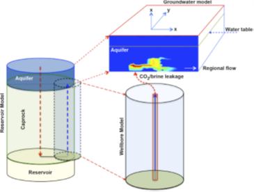

<b>
      Figure&nbsp;1: Beta Example Schematic. Figure from Carroll et al. (2014b) shows the links between reservoir, well leakage, and aquifer models using the alluvium case study. Links between reservoir, well leakage, and the carbonate case study are identical.
      </b>

      
      
      
      

The files included in this tutorial contain output data at specified times across all nodes representing hypothetical leakage scenarios from the CO2 storage formation. DREAM will be used to optimize monitoring configurations that minimize the estimated time to first detection (TTD) of CO2 leakage.

The DREAM GUI allows linear progression through a series of pages (Figure 2). The user can move back and forth but note that moving backwards may cause the user-inputs on later pages to be lost.

 

<b>
      Figure&nbsp;2: DREAM GUI Flow Chart
      </b>

 

 

<h2 style="margin-top:0in;margin-right:0in;margin-bottom:9.6pt;margin-left:0in;">3.1 DREAM Welcome Page</h2>

The DREAM<em>&nbsp;Welcome</em> page (Figure 3) provides links to the DREAM User Manual and literature detailing the technical development and theory behind the DREAM optimization algorithms&nbsp;(Yonkofski et al., 2016). The user is recommended to review the cited paper to thoroughly understand the objective function, decision variables and constraints, as well as the iterative process that DREAM performs to approach the optimal monitoring solution.

A conceptual figure on the right side of the <em>Welcome</em> window shows a theoretical DREAM application, with a leak from subsurface storage entering an overlying aquifer through an abandoned wellbore (Figure 3). While the user must provide the leakage scenario, this figurative example of inserts visualizes three of many monitoring configurations that DREAM can generate and assess during the iterative procedure. &nbsp;

 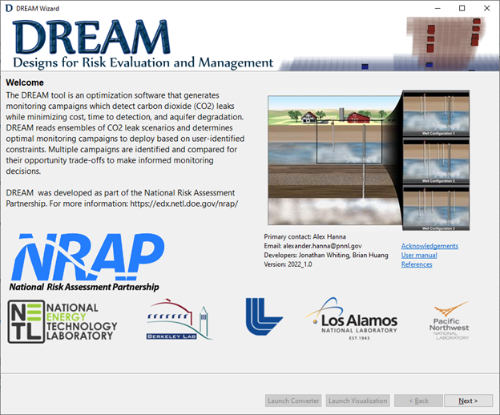

<b>
      Figure&nbsp;3: DREAM <em>Welcome</em> Page
      </b>

 

 

<h2 style="margin-top:0in;margin-right:0in;margin-bottom:9.6pt;margin-left:0in;">3.2 Input Directory Page</h2>

The <em>Input Directory</em> page (Figure 4) prompts the user to select all files or the directory containing the files of the subsurface leakage simulations to be analyzed. There are three file types available: H5, IAM, and DREAM save files. H5 files are generated by selecting <em>Launch Converter</em> in the footer, which converts subsurface simulation outputs (e.g., NUFT, STOMP) to a structured file storage with a value for each parameter at each model node and time step. IAM files are generated to support Open-IAM, which simulates leaks as reduced order representations. H5 files are larger but provide more flexibility as the user can set their own leak and detection values. IAM files are smaller, representing only fixed leak and detection spaces. DREAM save files load a previous set of inputs

The HDF5, IAM or DREAM save files must be directly available within the input directory provided; they may not be in subdirectories. All scenarios within the directory should reference a single geographic location or results will not make sense. If the user wants to assess multiple locations, it should be done with different DREAM runs.

If the user has not converted ASCII simulation output data into DREAM readable HDF5 input files, the <em>Launch Converter</em> button will open a pop-up file converter tool. Read more about the DREAM HDF5 Converter tool in Section 4.

For this example, HDF5 files under &ldquo;root/inputs/kimberlina_1_2/&rdquo; will be used as input files. These input files are based on NUFT simulations for a case study on geologic carbon storage. Click <em>Select a directory</em> and navigate to the HDF5 files directory.

 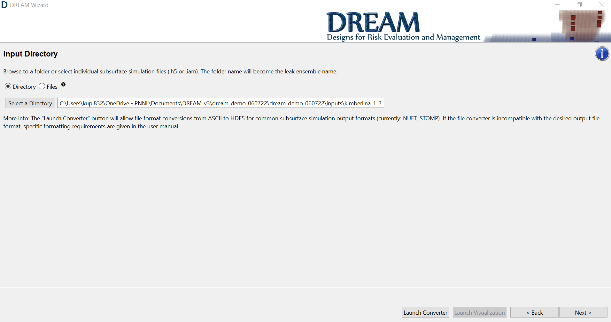

<b>
      Figure&nbsp;4: <em>Input Directory</em> Page&nbsp;(by folders)
      </b>

      
      
      

Alternatively, use the &ldquo;Files&rdquo; option to select a particular assortment of input files from a directory (Figure 5). Click <em>Next.</em>

 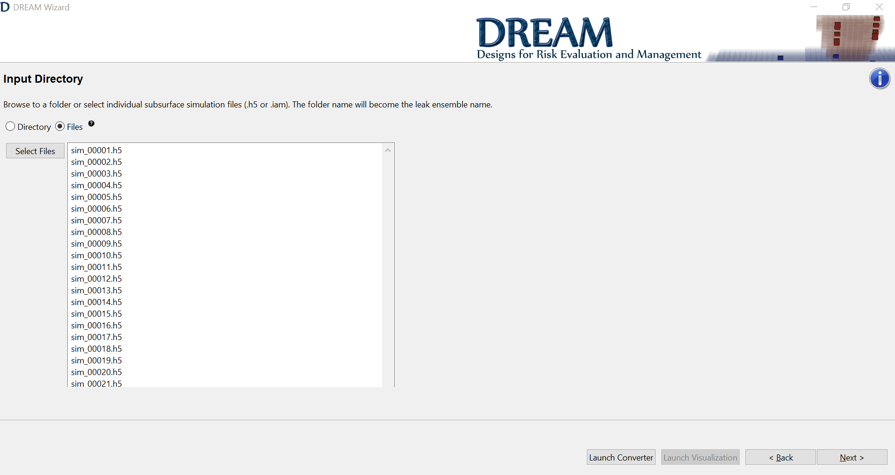

<b>
      Figure&nbsp;5: <em>Input Directory</em> Page&nbsp;(by filenames)
      </b>

      
      
      
      

A pop-up window (Figure 6) may prompt the user to specify any information missing from the HDF5 files, including porosity, units, and z-axis orientation, that will be specific to the model considered. Depending on units. If the HDF5 files are generated with the DREAM File Converter, they should contain all the necessary information and the user may never see this popup. IAM files will almost always ask for these inputs. The z-axis positive direction is important as depth of wells can factor into costs. Porosity is important as it factors into the volume of aquifer degraded calculations. Porosity can be entered in two ways: (1) as a variable in the HDF5 file that will allow porosity to vary across time and space or (2) as a constant scalar value that is applied to the whole domain either as an HDF5 attribute or entered in the pop-up window.

 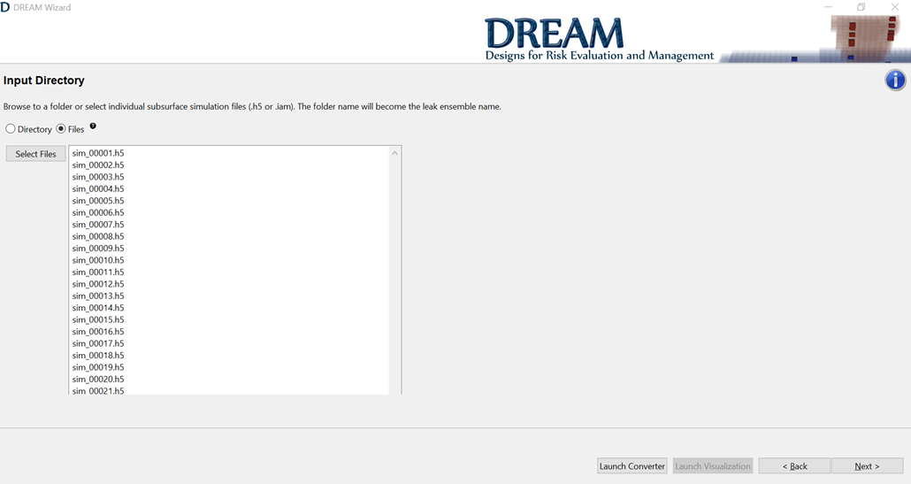

<b>
      Figure&nbsp;6: Pop-up to specify missing information
      </b>

      
      
      

If the loaded HDF5 or IAM files do not include units for an input, then it must be specified. The possible units that you might be required to specify are:

<ul>
<li>XYZ &ndash; meters or feet,</li>
<li>Z-Axis Positive Direction &ndash; up or down,</li>
<li>Time &ndash; years, months, or days,</li>
<li>Gravity units &ndash; mGal,</li>
<li>Pressure units &ndash; Pa,</li>
<li>Saturation &ndash; leave as unitless or add &ldquo;%&rdquo;, and</li>
<li>Set Porosity &ndash; insert as unitless value.</li>
</ul>

 

<h2>3.3&nbsp;&nbsp;&nbsp;&nbsp;&nbsp;&nbsp;&nbsp;&nbsp;&nbsp;&nbsp; Leak Definition</h2>

The <em>Leak Definition </em>page (Figure 7) allows the user to define what will be considered as a leak by taking a union of leak parameters, such as saturation and/or gravity, to specify a leak definition for some user-specified criteria.

&nbsp;

 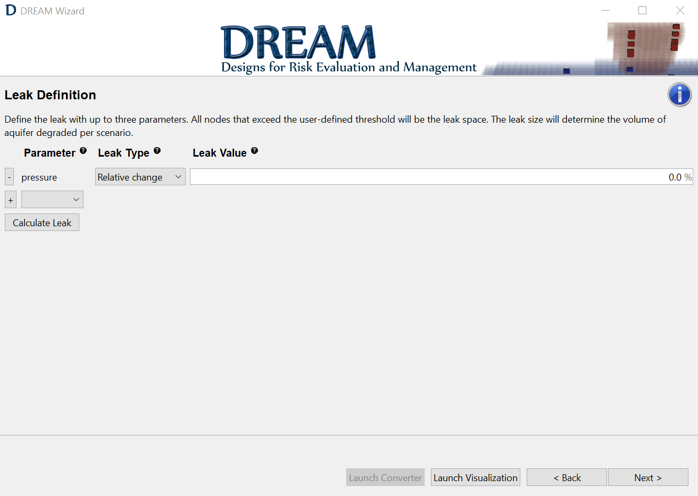

<b>
      Figure&nbsp;7: Scenario <em>Leak Definition</em> Page
      </b>

Under <em>Parameter</em>, pressure, saturation, and any other user-specified parameters can define a leak either individually or as a combination of parameters. Up to three parameters can be selected at a time to define a leak by taking the union of the selected parameters. Parameters are read in from the input H5 or IAM files and represent a value at each model node and timestep. The leak space is all the model nodes that exceed the defined type and value at any timestep. A carbon capture application might define the leak where CO2 saturation exceeds a maximum contaminant level.

Under <em>Leak Type</em>, there are three options that can be selected to define a leak:

<ul>
<li>&ldquo;Absolute change&rdquo; and &ldquo;Relative change&rdquo; define leaks as the change across time and may be limited to positive or negative change by providing a +/- sign before the value.
<ul>
<li>&ldquo;Absolute change&rdquo; is all nodes that change from the original value by the specified value.</li>
<li>&ldquo;Relative change&rdquo; is all nodes that change relative to the original values as a percent. It should not start at 0 to avoid blowing up to infinity, e.g., relative change = (new value &ndash; ref value) / ref value</li>
</ul>
</li>
<li>&ldquo;Above threshold&rdquo; and &ldquo;Below threshold&rdquo; define leaks as falling above and below, respectively, of the threshold in units of the parameter. The leak space is all nodes exceeding or less than the value.</li>
</ul>

The <em>Leak Type</em> can be set independently for each parameter and defines the type of change that is expected to signify a leak.

Hovering over the <em>Leak Value</em>will display the global minimum, average, and maximum for the parameter across all timesteps and scenarios to help the user make an informed selection. The leak value corresponds to the leak type and determines the leak space. The leak space is made of all model nodes that exceed the defined leak value at any scenario. This space determines how much aquifer has degraded at each timestep and scenario, indicating the size of the leak and potential environmental remediation costs.&nbsp; If multiple parameters are selected, the final leak space becomes the union of the parameters or nodes that meet any of the thresholds.

Most users may choose to select a CO2 parameter exceeding some value for carbon capture applications; although, pressure or other proxies may be necessary if a CO2 parameter is not available. Clicking <em>Calculate Leak</em> will calculate which nodes exceed the threshold in at least one scenario, and the number of nodes found should The number of nodes in the leak space must be greater than 0 to continue.

and remove the default pressure leak type (Figure 8)<em>. Then,</em> click <em>Calculate Leak </em>and view how many nodes exceeded the saturation threshold. Finally, click <em>Next</em>.
      
      
      
 

 

<b>
      Figure&nbsp;8: Calculating leak space on <em>Leak Definition</em> page
      </b>

     
     
     
     

Click <em>Launch Visualization</em> to display the visualization of potential leak plumes captured by pressure, gravity, and saturation profiles when the leak threshold is exceeded at any time (Figure 9). The user may toggle between views and change which parameters to display and what the color and transparency of the parameter should be. The user may zoom in and out with the mouse or scale the grid with the &ldquo;Scale X/Y/Z&rdquo; sliders located in the top right pane. The <em>Monitoring Plan</em> configuration tab will become useful once the DREAM tool has run. Close out of the Visualization Tool and select <em>Next</em> on the <em>Leakage Definition</em> Window.

 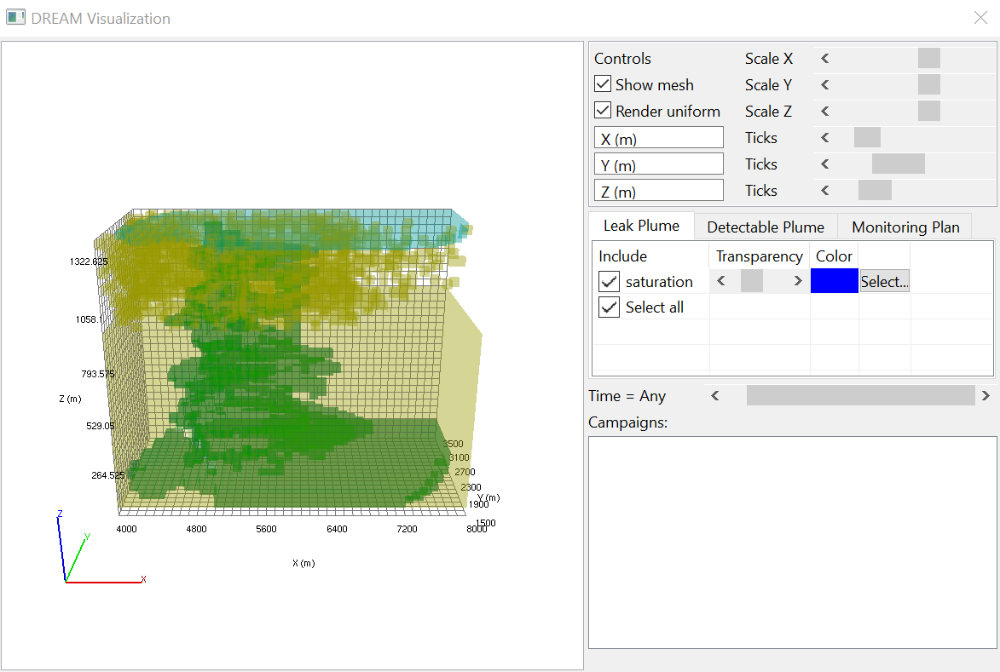

<b>
      Figure&nbsp;9: Interactive display of the leak plume after <em>Leak Definition</em>
      </b>

&nbsp;

<h2>3.4&nbsp;&nbsp;&nbsp;&nbsp;&nbsp;&nbsp;&nbsp;&nbsp;&nbsp;&nbsp; Scenario Weighting</h2>

. This can be done with a simple weight equation that can use any combination of the following three variables:

<ul>
<li><em>v </em>&ndash; maximum volume of aquifer degraded,</li>
<li><em>a </em>&ndash; user defined weights for <em>Variable A</em>, and</li>
<li><em>b</em> - user defined weights for <em>Variable B</em>.</li>
</ul>

(1) The maximum volume of aquifer degraded <em>v</em> is automatically calculated for each scenario threshold (see Section 3.3) and by multiplying porosity by the total volume of nodes that exceed the threshold. Porosity is either a constant or can be set individually for each node with the input HDF5 file. The maximum value at any time step can be used as the variable <em>v</em> with the scenario weighting equation.

(2) For variables <em>a </em>and <em>b</em>, they can manually be set by the user or can be read in from a CSV file and used as a variable in the &ldquo;Weight Equation&rdquo;. They can represent variables, such as scenario likelihood, potential remediation cost, proximity to an area of concern, and so on. The default settings for the variables do not need to be changed if all scenarios will be weighted equally.

(3) Weights are relative, but the user can scale the w or normalize them to be between 0 and 1 for clarity. The user can also remove scenario weighting by selecting the button <em>Set Weights Equal</em>. The <em>Scale Weights</em> button will maintain the same relative weights while scaling the numbers from 0 to 1, which is recommended when weights are very large. Weighting is important in DREAM because it optimizes monitoring campaigns by testing random sensor placements and iterating towards &lsquo;better&rsquo; solutions based on objectives. Weighting scenarios can influence which monitoring campaign is preferred. DREAM can also factor scenario weighting in Pareto optimization to rank the top performing monitoring campaigns.

During multi-objective optimization in the last phase of running DREAM, theFor <em>Weight Equation</em>, it can be modified as needed using any of the variables: <em>v, a</em>, or <em>b</em>.

In this example, the default scheme of equal weighting is applied (Figure 10).

 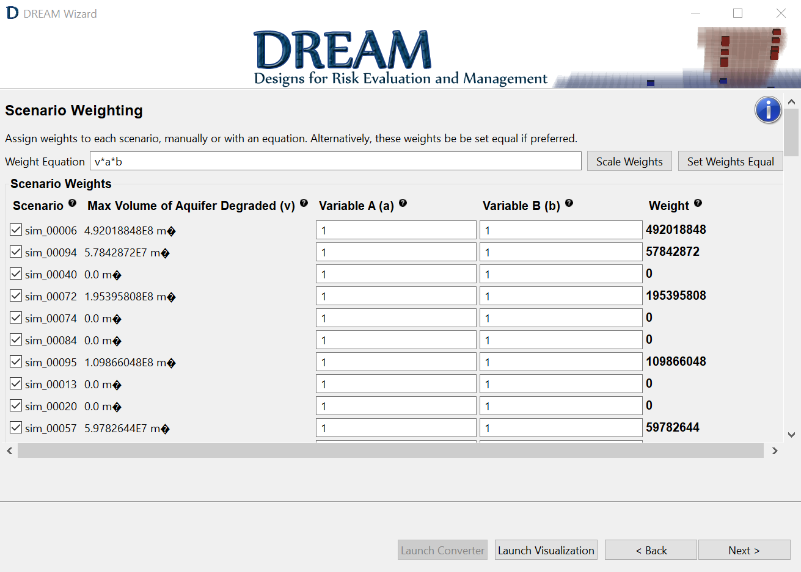

<b>
      Figure&nbsp;10: Default settings on <em>Scenario Weighting</em> page.</em>
      </b>

&nbsp;

<h2>3.5&nbsp;&nbsp;&nbsp;&nbsp;&nbsp;&nbsp;&nbsp;&nbsp;&nbsp;&nbsp; Detection Threshold</h2>

The <em>Detection Threshold</em> page (Figure 11) allows the user to select monitoring technologies that are being considered based on the parameters available in the input files, and to define associated parameters, such as deployment cost and detection threshold.

 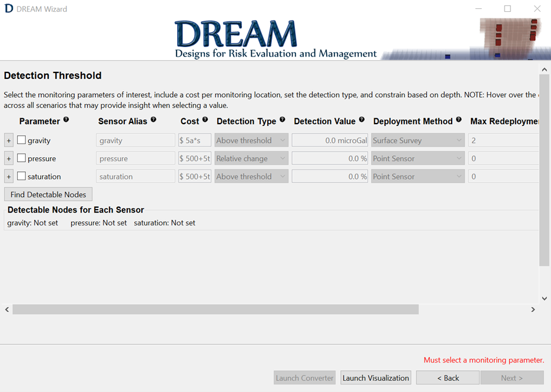

<b>
      Figure&nbsp;11: Default settings on <em>Detection Threshold</em>
      </b>

This page has a lot of information that defines each technology, including:</b>

<ul>
<li>The <em>&lsquo;+&rsquo; box</em> allows technologies to be competed, creating a second monitoring parameter option that can have different cost, detection information, or zone limitations. It can be used to duplicate a <em>Parameter</em> if there are multiple sensor options (e.g., cheap vs. expensive).</li>
<li>The <em>check box</em> enables or disables a monitoring technology from the optimization.</li>
<li><em>Parameter</em> is where parameters are read in from the input H5 or IAM files and represent a value at each model node and timestep. Check all parameters that should be considered for monitoring.</li>
<li><em>Sensor Alias</em> allows the user to assign a recognizable name to the technology.</li>
<li><em>Cost</em> allows the user to assign a value to each monitoring technology unit. Cost can be entered as an equation that varies based on deployment method. It is a primary objective that can be assessed with the optimization algorithm.
<ul>
<li>For point sensors (e.g., pressure, saturation), &lsquo;<em>t</em>&rsquo; represents time that the sensor is deployed and &lsquo;<em>i</em>&rsquo; represents the number of installations.</li>
<li>For surface surveys (e.g., gravity survey), &lsquo;a&rsquo; represents the area being surveyed and &lsquo;s&rsquo; represents the number of after the original baseline.</li>
</ul>
</li>
<li><em>Detection Type</em> and <em>Detection Value</em> define the technical capabilities of the monitoring technology and the magnitude of detection that will reliably identify a leak. <em>Detection Type </em>can be set independently for each parameter and defines the type of change that a sensor is able to detect.
<ul>
<li>&ldquo;Absolute change&rdquo; means the sensor detect when a parameter exceeds the value. It has units of the <em>Monitoring Parameter</em>. &ldquo;Relative change&rdquo; is detected as percent change from the original value as a percent. Both work across time and may be limited to positive or negative change by providing a +/- sign before the value.</li>
<li>&ldquo;Above threshold&rdquo; and &ldquo;Below threshold&rdquo; (units of <em>Monitoring Parameter)</em> define detection as surpassing and falling below, respectively, the given threshold.</li>
</ul>
</li>
</ul>

Hovering over the value input will display the global minimum, average, and maximum for the parameter across all timesteps and scenarios, helping the user make their selection.

<ul>
<li><em>Deployment Method</em> categorizes the monitoring technology as either a point sensor or surface survey.
<ul>
<li><em>&ldquo;</em>Point Sensors&rdquo; are deployed at a single location within a well and continuously collect data to detect scalar changes in a parameter; although, they may be redeployed several times.</li>
<li>&ldquo;Surface Surveys&rdquo; cover a large area and have any number of discrete deployments while a survey is conducted. They involve periodic measurements taken by a survey crew to detect changes. It is assumed that a survey is conducted at time 0, and all future survey are detecting change from this time.</li>
</ul>
</li>
<li><em>Max Redeployments</em> determines the maximum number of times that a single point sensor can be moved, or the maximum number of times that a surface survey may be conducted. Surface surveys must be set to greater than 1 so that at least one reading is taken. It has a different meaning for different deployment methods.</li>
<li><em>Zone Bottom</em> and <em>Zone Top</em> define depth limitations to where the monitoring technology can be placed. By default, these values are set to the global minimum and maximum. The value is greyed out for surface surveys since they are conducted at the surface.</li>
</ul>

 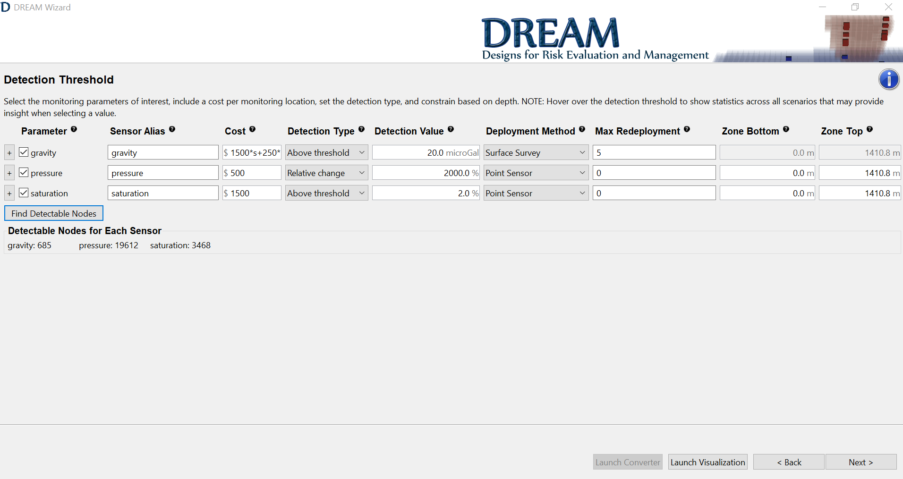

<b>
      Figure&nbsp;12: Specifying criteria for each monitoring technology on <em>Detection Threshold</em> page
      </b>

When loading IAM files, many user inputs are not available, as inputs are fixed during the process to generate IAM files. Some inputs may also be unavailable depending on the deployment method selected.

For this example, refer to Figure 12. First, select the <em>check box</em> for &ldquo;gravity&rdquo;, &ldquo;pressure&rdquo;, and &ldquo;saturation&rdquo;. Assign &ldquo;gravity&rdquo; with a cost equation of &ldquo;1500*s+250*a/1000000&rdquo; to represent $1500 per survey plus $250 per square kilometer of land surveyed. Gravity should also set <em>Detection Type</em> to &ldquo;Above threshold&rdquo;, <em>Detection Value</em> to 20 mGal, and <em>Max Redeployments</em> to 5. Pressure should set <em>Cost</em> to $500, <em>Detection Type</em> to &ldquo;Relative change&rdquo;, and <em>Detection Value</em> . Disclaimer: starting at 0 when calculating &ldquo;Relative change&rdquo; will cause an infinite value. Saturation should set <em>Cost</em> to $1500, <em>Detection Type</em> to &ldquo;Above threshold&rdquo;, and <em>Detection Value</em> to 2%. Finally, click <em>Find Detectable Nodes</em>. DREAM will calculate which nodes detect at least one scenario in the ensemble based on the user-defined detection type and value. The following values should appear next to each selected parameter type at the bottom of the page (Table 1).

Note: While the process is working, a red box appears to the right of the progress bar. Pressing this box cancels the process before completion but progress is saved.

<b>Table 1: Number of detectable nodes for each parameter in the example.</b>

<table>
<tbody>
<tr>
<td width="171">

<strong>Monitoring Parameter</strong>

</td>
<td width="180">

<strong>Detectable Plume</strong>

</td>
</tr>
<tr>
<td width="171">

Gravity

</td>
<td width="180">

685 nodes

</td>
</tr>
<tr>
<td width="171">

Pressure

</td>
<td width="180">

19612 nodes

</td>
</tr>
<tr>
<td width="171">

Saturation

</td>
<td width="180">

3468 nodes

</td>
</tr>
</tbody>
</table>

To visualize both the detectable plume and the leak plume, click <em>Launch Visualization </em>(Figure 13). When ready to continue, click <em>Next</em>.

 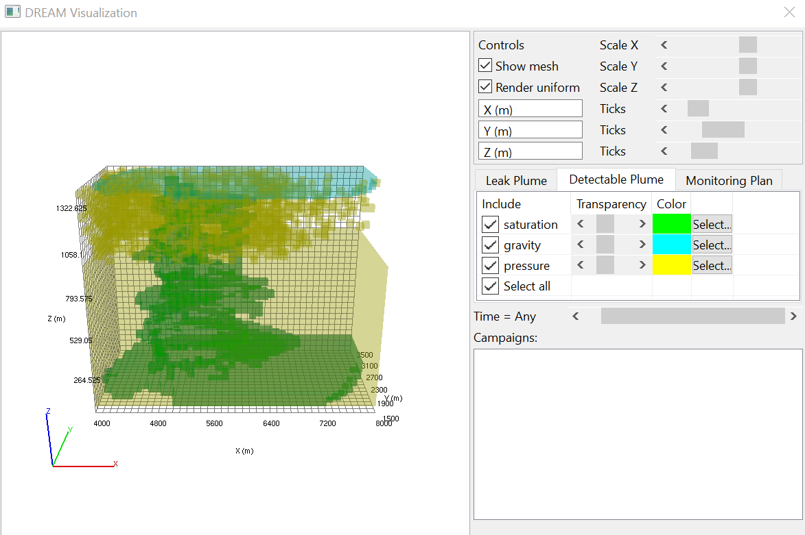

<b>
      Figure&nbsp;13: Visualization of detectable plume
      </b>

&nbsp;

<h2>3.6&nbsp;&nbsp;&nbsp;&nbsp;&nbsp;&nbsp;&nbsp;&nbsp;&nbsp;&nbsp; Detection Criteria</h2>

The <em>Detection Criteria</em> page (Figure 14) prompts the user to specify how many monitoring devices must be triggered to signify a leak has occurred. Only the sensors that were defined on the <em>Detection Threshold</em> page are selectable. &ldquo;Any Technology&rdquo; is a wildcard for any available sensors. Multiple criteria can be created by clicking the <em>Add a new criteria</em> button. Within a given test, the user may select any combination of specific technologies that will signify a leak. It is important to note that on this page we are taking all the instances where the nodes exceed the leak threshold from <em>Detection Threshold</em> (and <em>Leak Definition)</em> and are allowing the user to determine whether that instance qualifies as a &ldquo;leak&rdquo;, e.g., both pressure and saturation sensors exceed their leak detection thresholds.

Minimum Detections specifies how many detections from a specific sensor must exceed the user-defined value to have confidence that a leak occurred. Multiple tests with any combination of sensors can be created. To clarify, a full campaign of surface surveys monitoring an area is counted as one sensor, so it is advised not to require more than one surface survey. In most cases, it can be left at default, where one of any detecting sensors can identify a leak. For example, if both a cheap and expensive pressure sensor are available, two criteria can be created for one expensive or two cheap sensors need to be triggered to have a confidence in the leak.

 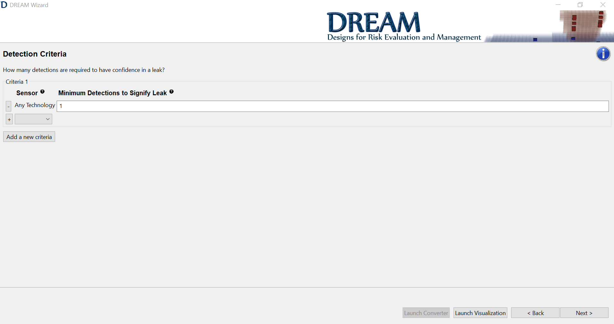

<b>
      Figure&nbsp;14: Default settings for <em>Detection Criteria</em> page
      </b>

For this example, set the first criteria, <em>Criteria 1</em>, to &ldquo;saturation&rdquo; with <em>Minimum Detections to Signify Leak </em>set to 1. Set the second criteria, <em>Criteria 2</em>, to &ldquo;gravity&rdquo; and &ldquo;pressure&rdquo; with <em>Minimum Detections to Signify Leak </em>set to 1 for each <em>Monitoring Technology </em>(Figure <strong>15</strong>). This implies confidence in a leak when either (1) a single saturation sensor exceeds the threshold or (2) both a gravity and pressure sensor exceed the threshold. Click <em>Next</em>.

 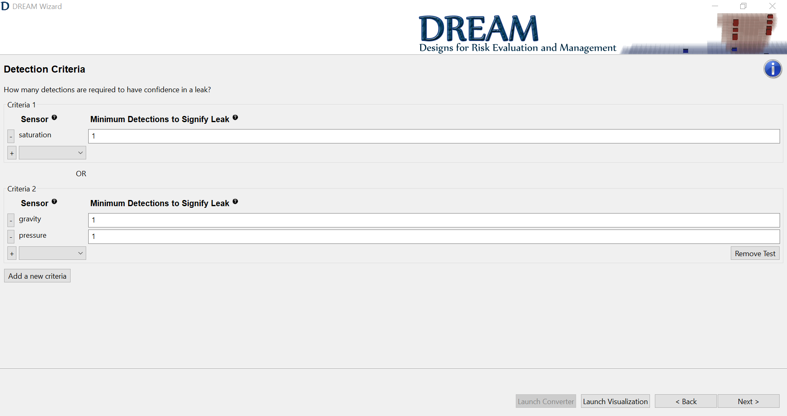

<b>
      Figure&nbsp;15: Setting criteria for detecting a leak on <em>Detection Criteria</em> page
      </b>

&nbsp;

<h2>3.7&nbsp; &nbsp; &nbsp; &nbsp; &nbsp; Monitoring Campaign Settings</h2>

The <em>Monitoring Campaign Settings </em>page (Figure 16) allows the user to specify additional information and constraints for monitoring campaigns. Some inputs apply to all campaigns, while others are only for surface surveys or point sensors. The following fields are available:

<ul>
<li><em>Maximum Monitoring Budget</em> sets a cap on the total cost for a campaign, including technology costs and well costs defined below. Leaving the value empty means there is no cap. Cost is a possible optimization objective, so it is not necessary to set a maximum. Setting a maximum that is too restrictive may cause problems for the algorithm. Hovering over the value box, it shows that a numeric value or a time-dependent equation using the variable &lsquo;t&rsquo; can be applied in setting a <em>Maximum Monitoring Budget</em>.</li>
<li><em>Number of Sensors </em>determines a range for the number of distinct technologies that can be included in a monitoring campaign. A sensor is defined either as a point sensor that can be relocated or a surface survey of fixed size that can be represented at multiple times. The algorithm will explore different numbers of sensors, but this sets hard limits on how many sensors can be included.</li>
<li><strong><em>Surface Surveys</em></strong>
<ul>
<li><em>Number of Station Locations Allowed</em> sets a range for how many nodes can be included in a single surface survey. Since surface surveys often measure change between surveys, survey size will remain constant across redeployments for a given campaign. By default, this value is set at 5%-40% of the total surface nodes. Hovering over these fields shows a tooltip with the total number of available surface nodes.</li>
</ul>
</li>
<li><strong><em>Point Sensors</em></strong>
<ul>
<li>sets a cap on the number of vertical wells that be included in a monitoring campaign. The algorithm will explore different numbers of wells, and the number of wells will affect the cost objective, but this sets a hard limit on how many wells of any depth can be considered for the campaigns. Leaving the value empty means there is no cap.</li>
<li><em>Minimum Distance Between Wells</em> constrains the wells to be at a certain distance from other wells. DREAM is limited by the model resolution that makes up the domain space and assumes that wells are placed in the center of the cell, for the purposes of distance calculations. In reality, a decision-maker will micro-site the recommended monitoring campaign to a location that makes sense.</li>
<li><em>Cost Per Well</em> and <em>Cost of Well Per unit Depth</em> assigns a cost to each well and for the depth of each well, respectively. This factors into the maximum monitoring budget and the cost objective. A numeric value or &nbsp;an equation can be entered for each field that includes &lsquo;t&rsquo; as a variable for time.</li>
</ul>
</li>
</ul>

 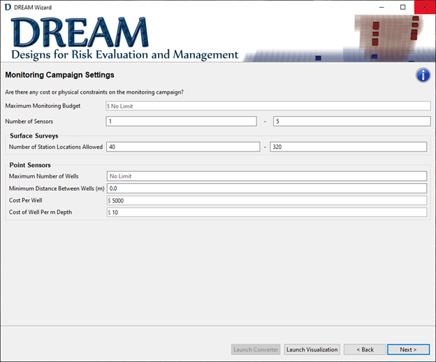

<b>
      Figure&nbsp;16: Default settings for <em>Monitoring Campaign Settings</em> page
      </b>

For this example shown in Figure 17, leave the default settings for <em>Maximum Monitoring Budget</em> to be empty (i.e., &ldquo;$No Limit&rdquo;) and Number of Sensors to range from 1-5. Set the <em>Number of Station Locations Allowed </em>under<em> <strong>Surface Surveys</strong> </em>to be between 20 and 200 nodes. Under <strong><em>Point Sensors</em></strong><em>,</em> set the <em>Maximum Number of Wells</em> to 3, the <em>Cost Per Well</em> to $500,000, and the <em>Cost of Well Per m Depth</em> (i.e., cost of well per unit depth) to $1,000. Leave the <em>Minimum Distance Between Wells</em> with a value of 0. Click <em>Next</em>.

      

 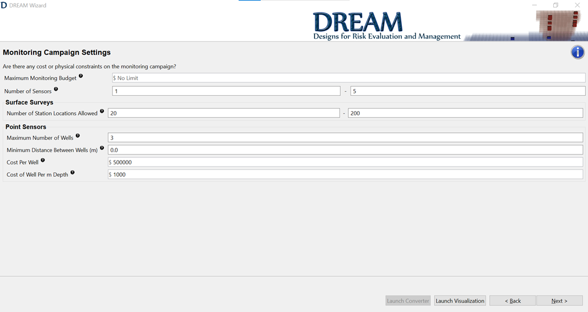

<b>
      Figure&nbsp;17: Example on <em>Monitoring Campaign Settings </em>page
      </b>

&nbsp;

<h2>3.8&nbsp; &nbsp; &nbsp; &nbsp; &nbsp; &nbsp;Exclude Locations</h2>

The <em>Exclude Locations</em> page (Figure 18) allows the user to exclude (x, y) locations from the monitoring configuration that are infeasible or unapproved. This window allows the user to manually deselect nodes that should not be used in the optimization algorithm. Note that if the solution space is too large, the user may not have the ability to exclude locations.

For this page, please continue with the default settings, which includes all locations. Click <em>Next</em>.

 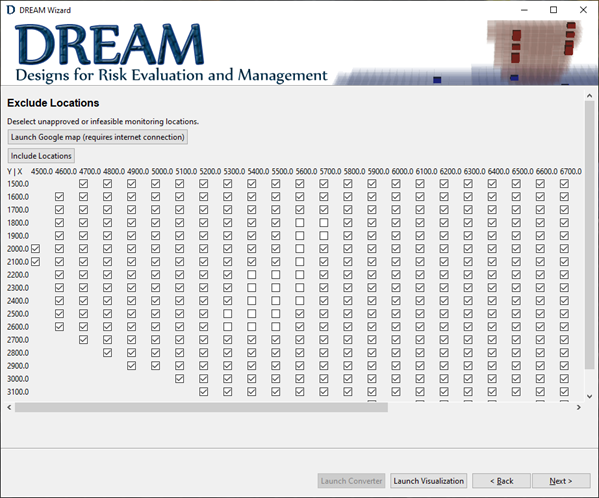

<b>
      Figure&nbsp;18: <em>Exclude Locations</em> Page showing an example with some of the nodes disabled
      </b>

&nbsp;

<h2>3.9&nbsp; &nbsp; &nbsp; &nbsp; &nbsp; &nbsp;Run DREAM</h2>

The <em>Run DREAM</em> page (Figure 19) provides a summary of the user inputs to the left. By default, a new &ldquo;results&rdquo; directory will be created to store output files. The output file location can be changed along with the output&rsquo;s filename.

&nbsp;

 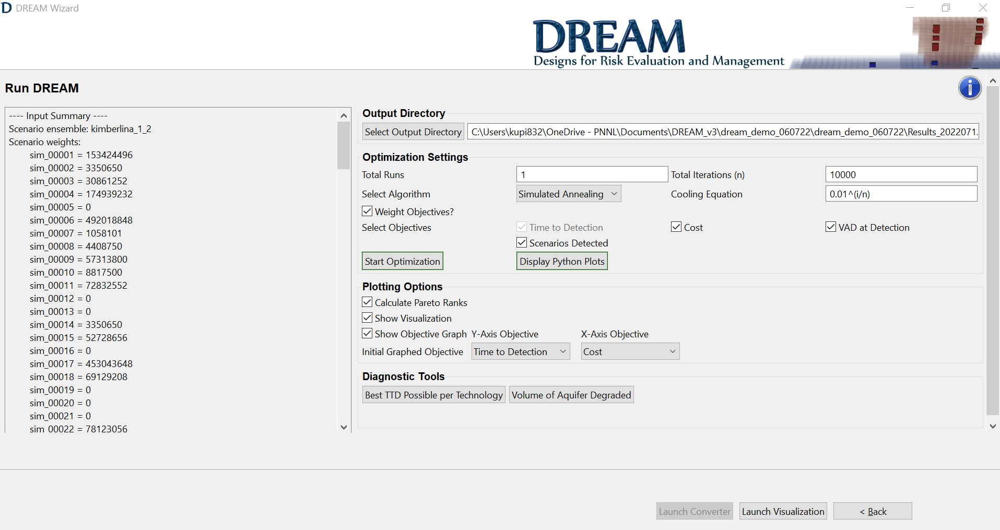

<b>
      Figure&nbsp;19: <em>Run Dream</em> Page 
      </b>

DREAM features several algorithms for identifying the optimal solution while factoring in multiple objectives. For more information about the available algorithms and which to select, see Optimization Algorithms. Under <strong><em>Optimization Settings</em></strong>, there may be additional inputs depending on the selected algorithm, such as cooling equation for Simulated Annealing. <em>Total</em> <em>Iterations</em> are the number of unique campaigns that are created by the <em>Selected Algorithm</em>. <em>Total Runs</em> allows multiple instances of the algorithms to run if restarting the process is required for a fresh start when the algorithm gets stuck in a local optimization and never reaches the global optimization. The user may assess any of the following objectives under <em>Select Objectives:</em> &nbsp;

<ul>
<li><em>Time to Detection</em> &ndash; A required objective; this determines how much time passes until the deployed technology detects a leak in accordance with the specified <em>Detection Criteria</em>. DREAM considers a shorter time to detection to be preferable.</li>
<li><em>Cost</em> (optional) &ndash; This objective includes the cost of each technology along with associated well costs for the campaign. Using equations on the <em>Cost</em> fields can allow for both capital and operating costs. DREAM considers lower costs to be preferable.</li>
<li><em>VAD at Detection</em> (optional) &ndash; Tied to the first objective, this calculates the volume of aquifer degraded at the time when the leak is first detected, representing the magnitude of the leak. DREAM considers lower volumes to be preferable.</li>
<li><em>Scenarios Detected</em> (optional) &ndash; Tied to the first objective, this calculates the percent of scenarios that are detected for a given monitoring campaign.</li>
</ul>

Objectives are assessed for each scenario, and there is a minimum of two objectives that must be assessed. Note that any objective (other than <em>Time to Detection</em>) can be disabled for any reason, like reducing computational time. These objectives may feed back into some algorithms at each iteration (refer to Appendix &nbsp;for more details about the objectives).

When the user clicks <em>Start Optimization</em>, up to two windows may appear if selected under <strong><em>Plotting Options</em></strong>. The user can choose to select <em>Calculate Pareto Ranks </em>(highly recommended), <em>Show Visualization</em>, or <em>Show Objective Graph</em>. The first page to display is the <em>Visualization</em> (Figure 20) that spatially displays each campaign overlaid with the leak space in a 3D space. The second page is an <em>Objective Graph</em> (Figure 21) that plots two objectives against one another to show progress as the optimization works towards an optimal solution. Under <em>Initial Graphed Objective</em>, the user can select which objectives to display in the Y- and X-Axes. Selecting <em>Calculate Pareto Ranks</em> will add a processing step after the iterations complete, . In other words, the multi-objective optimization will minimize the tradeoff in performance for the objectives. the DREAM only calculates the top 10 pareto ranks as they are expected to contain the best solutions. Once calculated, only the top ranks will be displayed on the <em>Visualization </em>page, and the ranks will be colored on the <em>Objective Graph</em>. It is recommended that the user leave <em>Calculate Pareto Ranks</em> enabled. The colors of the outputs (e.g., aqueous pressure or CO2) can be modified to suit the user&rsquo;s preference, and the included configurations or data can be disabled as desired.&nbsp;&nbsp;&nbsp;&nbsp;&nbsp;&nbsp;&nbsp;&nbsp;&nbsp;

 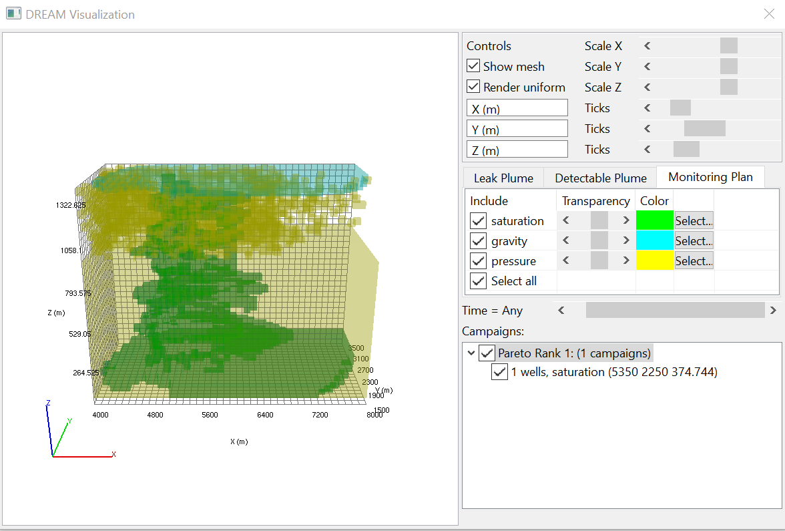

<b>
      Figure&nbsp;20: 3D visualization of monitoring campaigns and leak plumes from <em>Visualization</em> page
      </b>

&nbsp;

 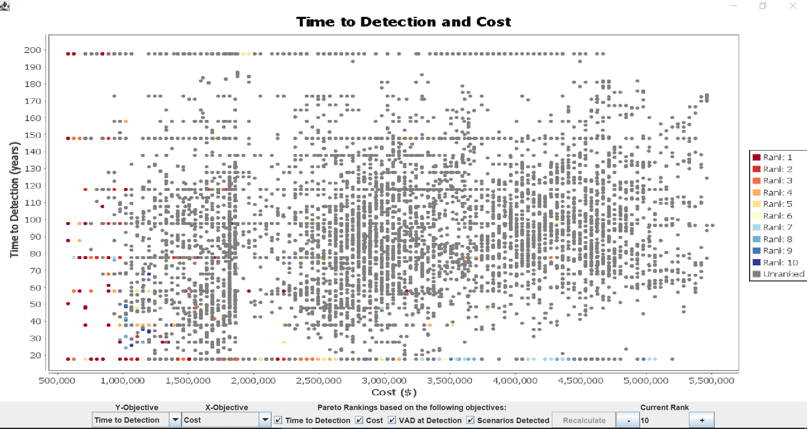

<b>
      Figure&nbsp;21: <em>Objective Graph </em>campaign performance between time to detection and cost objectives that is produced when <em>Calculate Pareto Ranks</em> is enabled
      </b>

Finally, there are a few optional <strong><em>Diagnostic Tools</em></strong> available, including:

<ul>
<li><em>Best TTD Possible per Technology</em> quickly generates a table providing the shortest time to detection for each monitoring technology, if hypothetically every node in the solution space was monitored. This provides no indication of optimal monitoring configurations but allows the user to understand the problem before running the iterative procedure. This table is outputted into the selected <em>Output Directory</em> as a csv file called &ldquo;best_ttd_table.csv&rdquo;. The Best TTD per Technology is calculated separately from the optimization, which means it will be the same regardless of what optimization algorithm is selected and does not need to be recalculated for each optimization algorithm ran.</li>
<li><em>Volume of Aquifer Degraded</em> quickly generates a table showing the average, minimum, and maximum volume of aquifer degraded across all scenarios at each time step, providing insight into the magnitude of leaks across the provided scenarios. This table is outputted into the selected <em>Output Directory</em> as a csv file called &ldquo;VolumeOfAquiferDegraded.csv&rdquo;. The VAD is calculated separately from the optimization, which means the VAD will be the same regardless of what optimization algorithm is selected and does not need to be recalculated for each optimization algorithm ran.</li>
</ul>

For this example, follow this progression:

<ol>
<li>Under <strong><em>Output Directory</em></strong>, choose where the outputted the files will be saved from this DREAM run. Click <em>Select Output Directory</em> to browse your directories, or manually type in the results directory of your choice.
<ol start="2">
<li>Click under <strong><em>Diagnostic Tools</em></strong> to view a summary of the lowest possible times to leakage detection. An excel file is created in the results directory specified (&ldquo;best_ttd_table.csv&rdquo;).</li>
<li>Click <em>Volume of Aquifer Degraded </em>under <strong><em>Diagnostic Tools</em></strong> to view a summary of the volume of aquifer degraded (VAD) per timestep (&ldquo;VolumeOfAquiferDegraded.csv&rdquo;).</li>
<li>Next, for <strong><em>Optimization Settings</em></strong>, select Heuristic algorithm at 1 run of 1000 iterations and keep all the objectives checked under <em>Select Objectives</em> (Figure 21). For <strong><em>Plotting Options</em></strong>, keep the default settings checked, including <em>Calculate Pareto Ranks</em>, <em>Show Visualization</em>, <em>Show Objective Graph</em>. For Initial Graphed Objective, choose the <em>Y-Axis Objective </em>to be &ldquo;Time to Detection&rdquo; and <em>X-Axis Objective</em> to be &ldquo;Cost&rdquo;. Click <em>Start Optimization</em>.</li>
<li>Run the optimization algorithm by clicking <em>Start Optimization</em>.
<ol>
<li>Check the <em>Calculate Pareto Ranks </em>box under <strong><em>Plotting Options</em></strong>. View the Pareto figure in real-time as it graphs each iteration. For this example, there should be &ldquo;Time to Detection&rdquo; selected for the <em>Y-Axis Objective</em> and &ldquo;Cost&rdquo; selected for the <em>X-Axis Objective</em> under <strong><em>Plotting Options</em></strong> for <em>Initial Graphed Objective</em>. The objectives can be changed as desired.</li>
<li>Check the <em>Show Visualization</em> box under <strong><em>Plotting Options</em></strong>. View the <em>DREAM Visualization </em>(Figure 20) that launches when you run the optimization. There are three tabs present: <em>Leak Plume</em>, <em>Detectable Plume</em>, and <em>Monitoring Plan</em>. In the bottom window, there is the option to select the box for Pareto Rank Run# and selectively view each of the top performing campaigns.</li>
</ol>
</li>
</ol>
</li>
</ol>
<h2>3.10&nbsp; &nbsp; &nbsp; &nbsp; &nbsp; &nbsp;Outputs</h2>

When DREAM completes, it creates several files in the specified results directory, including:

<ul>
<li><strong>Run#_AllCampaigns.csv</strong>
<ul>
<li>A file listing details on every iteration tested by the algorithm for each run set in <em>Total Runs</em>. It lists iteration number, scenarios with a leak detected, scenarios with no leak detected, the number of wells, time/location details for each monitoring technology in the campaign, average values for each objective (); however, in Simulate Annealing and Heuristic Algorithm, the weights are factored in.</li>
</ul>
</li>
</ul>
</li>
<ul>
<li><strong>EnsembleName_solutionSpace.txt</strong>     
<ul>
<li>A simple space-delimited text file that lists the XYZ location of each node, and either a &ldquo;0&rdquo; or &ldquo;1&rdquo; to show whether the node is part of the leak plume or a detectable plume. A &ldquo;1&rdquo; implies that the node surpasses the user-defined threshold for at least one scenario.</li>
</ul>
</li>
</ul>
</li>      
<ul>
<li><strong>TopCampaigns.csv</strong>
<ul>
<li>If <em>Calculate Pareto Ranks</em> was enabled, all campaigns within the top 10 Pareto ranks are listed in this file. This represents the best campaigns available based on the constraints and allows decision-makers to assess the cost trade-offs of the top options.</li>
</ul>
</li>
</ul>
</li>

The following sections will describe the process for analyzing the DREAM outputs using the post-processing features in DREAM.

&nbsp;

<h1>4.&nbsp;&nbsp;&nbsp;&nbsp; Pre-processing data</h1>

There are two file formats accepted by DREAM: (1) converting full leakage simulations into HDF5 files or (2) reading results from IAM, a reduced order model that uses a probabilistic framework from NRAP-Open-IAM.

To handle outputs from leakage simulations, DREAM provides the HDF5 Converter tool (Figure 22), which is pre-programmed to convert the output files from the following applications:

<ul>
<li>NUFT (Nonisothermal, Unsaturated Flow and Transport model; Nitao, 1998),</li>
<li>STOMP (Subsurface Transport Over Multiple Phases model; White and Oostrom, 2000), and</li>
<li>TECPLOT formatted output data to DREAM input files.</li>
</ul>

IAM files can also be configured as input files for DREAM. The user must provide the directory containing the time plot files of all the scenarios, organized according to the selected folder structure. The converter quickly reads the basic structure and allows the user to select monitoring parameters of interest and deselect unwanted time steps or scenarios. Select <em>Run</em> to begin the conversion process.

 

<b>
      Figure&nbsp;22: DREAM HDF5 Converter Tool
      </b>

<b>Figure 22: DREAM HDF5 Converter Tool</b>

&nbsp;

&nbsp;&nbsp;&nbsp;

<h2>4.1&nbsp;&nbsp;&nbsp;&nbsp;&nbsp;&nbsp;&nbsp;&nbsp;&nbsp;&nbsp; STOMP Data</h2>

The DREAM file converter will accept most output types from STOMP. The required directory hierarchy is &ldquo;ensemble folder\scenario folders\file per time step&rdquo;. Detailed information follows below.

<strong>Folder Structure</strong>

For STOMP output, a folder with sub folders is expected. Each subfolder contains all the data for a given scenario. Within the scenario folder, there should be one file for each time step that contains data for all the variables. Each scenario needs to have the same number of time steps and the same set of variables.

stomp_ensemble/scenario1/plot.1

stomp_ensemble/scenario1/plot.2

stomp_ensemble/scenario2/plot.1

stomp_ensemble/scenario2/plot.2

<strong>File Example: stomp_ensemble/scenario1/plot.1 </strong>

This example file contains data for the first timestep from the first scenario. XYZ data in STOMP is expected in x, then y, then z ordering. <strong>Required </strong>inputs are in bold, and optional data is in <em>italics</em>.

&nbsp;

----------------------------- Beginning of File

<em>Number of Time Steps =&nbsp;&nbsp;&nbsp;&nbsp;&nbsp;&nbsp; 2</em>

<strong>Time =&nbsp; 1,yr </strong>

<strong>Number of X or R-Direction Nodes =&nbsp;&nbsp;&nbsp;&nbsp; 2</strong>

<strong>Number of Y or Theta-Direction Nodes =&nbsp;&nbsp; &nbsp;&nbsp;2</strong>

<strong>Number of Z-Direction Nodes =&nbsp;&nbsp;&nbsp;&nbsp; 2</strong>

<em>Number of Active Nodes =&nbsp; 8</em>

<em>Number of Vertices = 8</em>

<strong>X-Direction Nodal Vertices, m</strong>

&nbsp;0 1 0 1 0 1 0 1

&nbsp;1 2 1 2 1 2 1 2

&nbsp;0 1 0 1 0 1 0 1

&nbsp;1 2 1 2 1 2 1 2

&nbsp;0 1 0 1 0 1 0 1

&nbsp;1 2 1 2 1 2 1 2

&nbsp;0 1 0 1 0 1 0 1

&nbsp;1 2 1 2 1 2 1 2

<strong>Y-Direction Nodal Vertices, m</strong>

&nbsp;0 0 1 1 0 0 1 1

&nbsp;0 0 1 1 0 0 1 1

&nbsp;1 1 2 2 1 1 2 2

&nbsp;1 1 2 2 1 1 2 2

&nbsp;0 0 1 1 0 0 1 1

&nbsp;0 0 1 1 0 0 1 1

&nbsp;1 1 2 2 1 1 2 2

&nbsp;1 1 2 2 1 1 2 2

<strong>Z-Direction Nodal Vertices, m</strong>

&nbsp;0 0 0 0 1 1 1 1

&nbsp;0 0 0 0 1 1 1 1

&nbsp;0 0 0 0 1 1 1 1

&nbsp;0 0 0 0 1 1 1 1

&nbsp;1 1 1 1 2 2 2 2

&nbsp;1 1 1 1 2 2 2 2

&nbsp;1 1 1 1 2 2 2 2

&nbsp;1 1 1 1 2 2 2 2

<strong>Data type 1</strong>, <em>units</em>

&nbsp;1.2 1.2 1.2 6.3 1.2 1.2 1.2 1.2

<strong>Data type 2</strong>, <em>units</em>

&nbsp;4.5 4.5 4.5 4.5 4.5 4.5 4.5 4.5

&nbsp;

--------------------------------------- End of File

<strong><u>&nbsp;</u></strong>

<h2>4.2&nbsp;&nbsp;&nbsp;&nbsp;&nbsp;&nbsp;&nbsp;&nbsp;&nbsp;&nbsp; NUFT Data</h2>

The DREAM file converter will accept most output types from NUFT given in NTAB format. The required directory hierarchy is &ldquo;ensemble folder\file per parameter and time step&rdquo;. Detailed information follows below.

<strong>Folder Structure</strong>

For a NUFT output, a single folder is expected for the entire ensemble. Each file should represent a parameter for each scenario. All scenarios should have the same parameters. Each scenario needs to have the same number of time steps.

ntab_ensemble/parameter1_scenario1.ntab

ntab_ensemble/parameter1_scenario2.ntab

ntab_ensemble/parameter2_scenario1.ntab

ntab_ensemble/parameter2_scenario2.ntab

<strong>File Example:</strong> <strong>ntab_ensemble/parameter1_scenario1.ntab </strong>

This file contains data for all time steps of parameter 1. <strong>Required </strong>inputs are in bold, and optional data is in <em>italics</em>.

----------------------------- Beginning of File

&nbsp;

<em>index</em> <strong>i j k</strong> <em>element_ref nuft_ind</em> <strong>x y z</strong> <strong>dx dy dz volume</strong> <strong>1.0y 2.0y</strong>

1 1 1 1 52 1 0.5 0.5 0.5 1 1 1 1 1.2 1.2

2 2 1 1 52 2501 1.5 0.5 0.5 1 1 1 1 1.2 1.2

3 1 2 1 52 5001 0.5 1.5 0.5 1 1 1 1 1.2 6.3

4 2 2 1 52 7501 1.5 1.5 0.5 1 1 1 1 6.3 6.3

5 1 1 2 52 10001 0.5 0.5 1.5 1 1 1 1 1.2 1.2

6 2 1 2 52 12501 1.5 0.5 1.5 1 1 1 1 1.2 1.2

7 1 2 2 52 15001 0.5 1.5 1.5 1 1 1 1 1.2 1.2

8 2 2 2 52 17501 1.5 1.5 1.5 1 1 1 1 1.2 1.2

&nbsp;

--------------------------------------- End of File

&nbsp;

<h2>4.3&nbsp;&nbsp;&nbsp;&nbsp;&nbsp;&nbsp;&nbsp;&nbsp;&nbsp;&nbsp; TECPLOT Data</h2>

If the user has plot files generated by another subsurface simulation code, it is recommended to reformat the plot file to fit an accepted ASCII format. TECPLOT formats are accepted due to their prevalent use in post-processing. &nbsp;

<strong>Folder Structure</strong>

For Tecplot output, DREAM expects a single folder containing a TECPLOT file for each scenario. Each tecplot file is expected to contain all the time steps and all the data for that scenario. Each scenario needs to have the same number of time steps and the same set of variables.

tecplot_ensemble/scenario1.dat

tecplot_ensemble/scenario2.dat

<strong>File Example:</strong> <strong>tecplot_ensemble/scenario1.tecplot</strong>

This file contains data for all time steps and all data types. XYZ are expected to be nodal and should be in z then y then x ordering. All data is expected to be cell centered. <strong>Required </strong>keys are in bold, and optional data is in <em>italics</em>.

----------------------------- Beginning of File

<em>TITLE = "Scenario 1"</em>

<strong>VARIABLES = "X, m" "Y, m" "Z, m" "data type 1" "data type 2"</strong>

<strong>ZONE </strong>T = "1, y" , <em>STRANDID = 1<strong>,</strong></em><strong> SOLUTIONTIME = 1</strong>, <strong>NODES = 64</strong>, <strong>ELEMENTS = 8</strong>, <em>DATAPACKING = BLOCK, ZONETYPE = FEBRICK</em>

<em>VARLOCATION = ([4,5] = CELLCENTERED)</em>

0 1 0 1 0 1 0 1

0 1 0 1 0 1 0 1

0 1 0 1 0 1 0 1

0 1 0 1 0 1 0 1

1 2 1 2 1 2 1 2

1 2 1 2 1 2 1 2

1 2 1 2 1 2 1 2

1 2 1 2 1 2 1 2

0 0 1 1 0 0 1 1

0 0 1 1 0 0 1 1

1 1 2 2 1 1 2 2

1 1 2 2 1 1 2 2

0 0 1 1 0 0 1 1

0 0 1 1 0 0 1 1

1 1 2 2 1 1 2 2

1 1 2 2 1 1 2 2

0 0 0 0 1 1 1 1

1 1 1 1 2 2 2 2

0 0 0 0 1 1 1 1

1 1 1 1 2 2 2 2

0 0 0 0 1 1 1 1

1 1 1 1 2 2 2 2

0 0 0 0 1 1 1 1

1 1 1 1 2 2 2 2

1.2 1.2 1.2 6.3 1.2 1.2 1.2 1.2

4.5 4.5 4.5 4.5 4.5 4.5 4.5 4.5

&nbsp;

<strong>ZONE</strong> T = "2, y" , <em>STRANDID = 1<strong>, </strong></em><strong>SOLUTIONTIME = 2</strong>, <strong>NODES = 64, ELEMENTS = 8</strong>, <em>DATAPACKING = BLOCK, ZONETYPE = FEBRICK VARSHARELIST = ([1,2,3]=1), CONNECTIVITYSHAREZONE = 1</em>

<em>VARLOCATION = ([4,5] = CELLCENTERED)</em>

1.2 1.2 6.3 6.3 1.2 1.2 1.2 6.3

4.5 4.5 4.5 4.5 4.5 4.5 4.5 4.5

--------------------------------------- End of File

&nbsp;

<h2>4.4&nbsp;&nbsp;&nbsp;&nbsp;&nbsp;&nbsp;&nbsp;&nbsp;&nbsp;&nbsp; HDF5 Output</h2>

For each of the three examples, DREAM will create a directory with the same name as the parent directory with an &ldquo;_hdf5&rdquo; appended. Inside the directory will be an HDF5 file for each scenario that contains all the time steps for all the data types along with the grid information. All data will be cell centered.

<strong>File Example:</strong>

The HDF5 files can be viewed with HDFView (Figure 23).

 

<b>
      Figure&nbsp;23: HDFView of DREAM input file structure.
      </b>

Each scenario will contain a &ldquo;data&rdquo; group that contains metadata about the scenario: porosity information (optional), steps and their matching times, the grid XYZ vertices or edges (e.g., vertex-x, vertex-y, and vertex-z), and the grid XYZ centers (e.g., x, y, and z). There will also be a group for each time step containing 3D data for each parameter at that time step. Lastly, there is a &ldquo;statistics&rdquo; group that lists the global minimum, average, and maximum for each parameter to expedite future calculations.

DREAM also assigns attributes to variables in the HDF5 file. This includes &ldquo;units&rdquo; for time, XYZ vertices and centers, and for each parameter; although, some parameters may be unitless. A &ldquo;positive&rdquo; attribute of up or down is assigned to the Z vertex and center to denote whether the model uses depth or height. If attributes are missing, DREAM will simply ask for the user to input this information.

<h2>4.5&nbsp;&nbsp;&nbsp;&nbsp;&nbsp;&nbsp;&nbsp;&nbsp;&nbsp;&nbsp; IAM Output</h2>

IAM can quickly create many scenarios, all of which should be placed in a single directory. As part of the process of creating these files from IAM, the user must select a detection criteria and threshold for each parameter. Therefore, the IAM files only contain detecting nodes for the inputted detection values, causing values to be greyed out on the Leakage Criteria page. To test different detection values, IAM must be rerun to generate a new set of IAM files.

<strong>File Example:</strong>

Each file has a header that lists IAM, scenario number, parameter, the detection criteria (relative change, absolute change, above, below), and the detection threshold. A negative or positive sign can be placed before the detection threshold to limit to a positive or negative change, otherwise the change threshold will work in both positive and native directions.

Following the header is a list of all detecting nodes for the given detection values. Each line represents a node and lists X, Y, Z, and time to first detection.

The same detection criteria and threshold should be used across all scenarios for a given parameter. All data is expected to be cell centered. <strong>Required </strong>keys are in bold, and optional data is in <em>italics</em>.

----------------------------- Beginning of File

<strong>IAM,1,Dissolved_CO2,relative,0.2,</strong>

776568.2414698162,14468825.459317585,-2343.3581219014286,25202.25

776568.2414698162,14468858.267716534,-2343.3581219014286,24837.0

776568.2414698162,14468891.076115485,-2343.3581219014286,25567.5

776601.0498687663,14468759.842519684,-2343.3581219014286,24106.5

776601.0498687663,14468792.650918635,-2343.3581219014286,21915.0

--------------------------------------- End of File

&nbsp;

<h1>5.&nbsp;&nbsp;&nbsp;&nbsp; Post-Processing Data</h1>

Once the user has finished running DREAM, the results directory can be located to find the outputted files: ensemblename_solutionSpace.txt, Run#_AllCampaigns.csv, TopCampaigns.csv, and VolumeOfAquiferDegraded.csv.

For &ldquo;ensemblename_solutionSpace.txt&rdquo;, the data file includes columns with nominal values for <em>x</em>,<em>y</em>,<em>z </em>centered points, and the corresponding values for &ldquo;<em>saturation</em>&rdquo;, &ldquo;<em>gravity</em>&rdquo;, and &ldquo;<em>pressure</em>&rdquo;.

For &ldquo;Run#_AllCampaigns.csv&rdquo;, the data file has multiple columns, including

<ul>
<li><em>Iteration </em>of optimization algorithm is how many simulations or monitoring campaigns are generated</li>
<li><em>Scenarios with Leak Detected </em>corresponds to the percent of scenarios when a leak was detected, and which simulations detected a leak. For example, &ldquo;1%: sim_0086&rdquo; means that out of all simulations, only 1% of the simulations detected a leak, which only includes simulation #86 in this example.</li>
<li><em>Scenarios with No Leak Detected </em>corresponds to the percent of scenarios when a leak was not detected, and it includes the simulations (if any) that had undetected leaks. For example, &ldquo;99%: sim_0075, sim 0101, sim 830&rdquo; means that simulations 0075, 0101, and 830 had leaks that went undetected. The value 99% is the percent of simulations that predicted no leaks.</li>
<li><em>Average TTD of Successful Scenarios </em>is the average time to detection if there are any leaks detected.</li>
<li><em>Average VAD at TTD </em>is the estimated volume of aquifer degraded if there are any leaks detected.</li>
<li><em>Average Cost of Successful Scenarios </em>is the proposed cost for installing monitoring technologies and wells along with the cost of upkeep for monitoring one to many leaks.</li>
<li><em>Number of Wells </em>provides the optimal number of wells needed for monitoring the proposed campaign.</li>
<li><em>Sensor Types (x y z) </em>provides the location of the proposed monitoring technology to install for optimal coverage. It also includes how long the monitoring technology should be deployed. An example of the values in <em>Sensor Types (x y z) </em>is &ldquo;gravity: 20 40 120 years (4450 2650 1388) &hellip; (4000 2020 1500)&rdquo; and &ldquo;saturation: 50 years (4850 4400 1290) 20 years (4800 4400 1290)&rdquo;. This output means that a gravity survey is suggested to occur on the 20th, 40th, and 120th year after the monitoring campaign begins, and the gravity survey will be taken over the area covering all nodes, including node (x=4450m, y=2650m, z=1388m) to node (x=4000m, y=2020m, z=1500m). For saturation, the point sensor will be deployed at node (x=4850m, y=4400m, z=1290m), and it is expected to occur on the 50th year after the start of the campaign. Twenty years later, the point sensor will be redeployed to node (x=4800m, y=4400m, z=1290m) until the end of the monitoring campaign.</li>
</ul>

Note that the user can reproduce the Pareto rank figure using the data in &ldquo;Run#_AllCampaigns.csv&rdquo;.

For &ldquo;TopCampaigns.csv&rdquo;, the data file has multiple columns, including

<ul>
<li><em>Pareto Rank </em>outputs a positive integer that ranks which scenarios and monitoring campaigns minimize the tradeoff between the objectives, i.e., Pareto optimal set, selected under <strong><em>Optimization Settings </em></strong>and <strong><em>Plotting Options</em></strong>. A rank number of 1 indicates Pareto optimality in balancing the tradeoff between both objectives.</li>
<li><em>Scenarios with Leak Detected </em>finds the scenarios where leak(s) are detected.</li>
<li><em>Scenarios </em>includes a list of all simulated leaks from the user selected optimization algorithm.</li>
<li><em>Average TTD of Successful Scenarios </em>is explained above.</li>
<li><em>Average VAD at TTD </em>is explained above.</li>
<li><em>Average Cost of Successful Scenarios </em>is explained above.</li>
<li><em>Number of Wells </em>is explained above.</li>
<li><em>Sensor Types (x y z) </em>is explained above.</li>
</ul>

For &ldquo;VolumeOfAquiferDegraded.csv&rdquo;, the data file has multiple columns, including <em>Time</em> (units specified by user or within the input files), and the <em>Average</em>, <em>Minimum</em>, and <em>Maximum VAD</em> (units of volume, e.g., cubic meters), which are the estimated ranges for volume of aquifer degraded. The final column is <em>Total Possible VAD</em>.

<h2>5.1&nbsp;&nbsp;&nbsp;&nbsp;&nbsp;&nbsp;&nbsp;&nbsp;&nbsp;&nbsp; Python Visualization</h2>

Post-processing of the DREAM run can be executed by clicking <em>Display Python Plots </em>under <strong><em>Optimization Settings</em></strong>. Multiple figures will be produced and then automatically saved to the specified output directory under a subdirectory called &ldquo;Figures&rdquo;. Below is a list of acronyms that are used in specifying the parameters in the figures.

Parameter List of Acronyms

<ul>
<li>PLD - Percent of Leaks Detected</li>
<li>PMCD - Percent Mass of CO2 Detected</li>
<li>PMMCD &ndash; Percent Mass of CO2 Detected at Max Leak</li>
<li>TTD &ndash; Time to Detection</li>
<li>VAD &ndash; Volume of Aquifer Degraded</li>
</ul>

The goal of post-processing after running DREAM is to aid the user in understanding the outputs and how to make informative decisions with these results. In the following section, the different types of figures produced are discussed. Please read below for a description of each figure&rsquo;s purpose and how it can aid in interpreting the results and/or selecting a suitable monitoring campaign.

As an example, to aid this discussion, there will be figures produced from the dataset, &ldquo;root/outputs/kimberlina_1_2/outputs/pres_sat_grav/Run1_AllCampaigns_sa_10k.csv&rdquo;, which can be found under the user&rsquo;s root directory if the DREAM demo has been downloaded. The example is from a single DREAM run using Simulated Annealing with 10,000 iterations and the default cooling equation.

<ul>
<li>PLD &amp; PMCD vs TTD
<ul>
<li>A dual panel view of PLD and PMCD (e.g., Figure 24) is insightful for identifying if there are some leaks that are more important than others. It showcases where the bulk of leaks are as well as the less frequent but larger leaks. PLD and PMCD are plotted against TTD to see how TTD is related to the two parameters.</li>
<li>Questions to consider are: how is TTD affected by solely looking at percent of leaks detected compared to the percent mass of CO2 detected? Is one of these objectives more indicative of performance than the other?</li>
<li>In</li>
</ul>
</li>
</ul>

 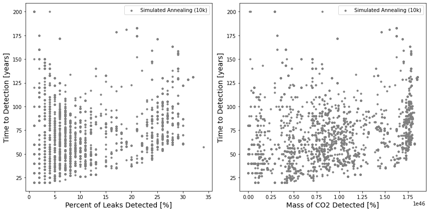

<b>
      Figure&nbsp;24: Simulated annealing example of PLD and PMCD versus TTD &nbsp;
      </b>

<ul>
<li>PLD &amp; PMCD vs Monitoring Cost
<ul>
<li>Similar to (a), this figure is another dual panel view of PLD and PMCD (e.g., Figure 25). A dual panel view of PLD and PMCD is insightful for identifying if there are some leaks that are more important than others. It showcases where the bulk of leaks are as well as the less frequent but larger leaks. PLD and PMCD are plotted against Monitoring Cost.</li>
<li>Questions to consider are: how is it better to use PLD or PMCD when budgeting for a CO2 monitoring campaign?</li>
<li>In Figure 25, PLD might be useful in providing more consistent estimates for monitoring costs compared to PMCD.</li>
</ul>
</li>
</ul>

 

<b>
      Figure&nbsp;25: Simulated annealing example of PLD and PMCD versus Monitoring Cost
      </b>

<ul>
<li>PLD vs PMCD
<ul>
<li>Ideally, a one-to-one or linear relationship between PLD and PMCD is expected to highlight the fact that as the percent of leaks detected increases so too will the percent mass of CO2 detected (e.g., Figure 26). If there are outliers, this indicates that some leaks are undetected.</li>
<li>Questions to consider are: how many wells and monitoring technologies have been deployed? Are there any constraints or leak detection thresholds that can be affecting the number of undetected leaks?</li>
<li>In Figure 26, the PMCD is greater than the PLD, meaning some leaks are going undetected.</li>
</ul>
</li>
</ul>

 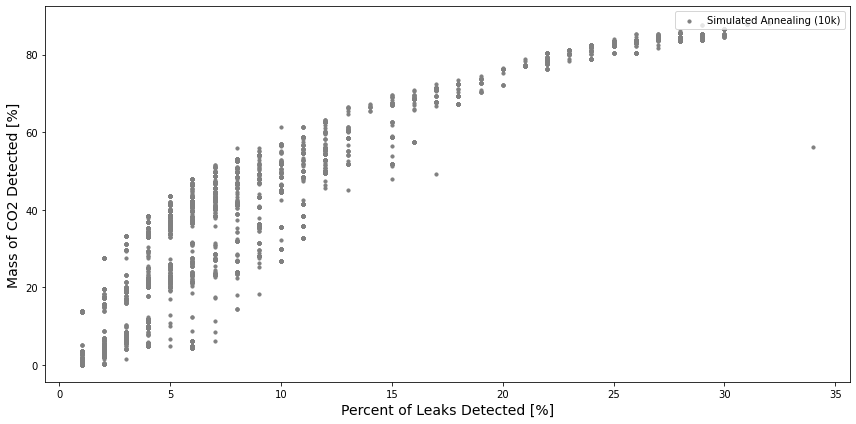

<b>
      Figure&nbsp;26: Simulated annealing example of PLD versus PMCD
      </b>

<ul>
<li>TTD vs Monitoring Cost
<ul>
<li>As TTD increases, the expenses for monitoring the site are expected to drive up (e.g., Figure 27). When the cost for monitoring is very low, this corresponds to proposed monitoring campaigns that are likely only using surface arrays and not drilling any wells.</li>
<li>Questions to consider are: what tradeoff is the user comfortable with, e.g., higher monitoring costs to capture all leaks?</li>
<li>In Figure 27, there is not a defined relationship between TTD and Monitoring Cost. This shows that PLD or PMCD are probably better or more informative indicators of Monitoring Cost.</li>
</ul>
</li>
</ul>

 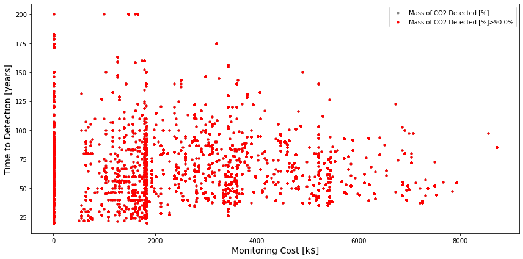

<b>
      Figure&nbsp;27: Simulated annealing example of Monitoring Cost versus TTD
      </b>

<ul>
<li>VAD vs TTD
<ul>
<li>VAD is generally not a highly informative parameter. However, examining VAD versus TTD can show if there is a one-to-one relationship as the number of leaks detected increases (Figure 28). If there are some outliers or scattering, this indicates that there are some undetected leaks, which are being captured by a growing value of VAD.</li>
<li>Questions to consider are: what is different between monitoring campaign scenarios that might be significantly impacting TTD?</li>
<li>In Figure 28, the initial VAD has some variability with respect to TTD for the first 0.3 but as more aquifer volume is degraded, the TTD linearly increases with VAD.</li>
</ul>
</li>
</ul>

 

<b>
      Figure&nbsp;28: Simulated annealing example of VAD versus TTD
      </b>

<ul>
<li>PMCD &amp; PMMCD vs TTD
<ul>
<li>This dual panel view is comparing the mass of CO2 detected at the end of the monitoring campaign to the mass of CO2 detected when there is maximum saturation (i.e., largest leak detected). This figure aims to highlight the discrepancy (if any) between PMCD and PMMCD (e.g., Figure 29).</li>
<li>For example, it can help address if there is a large enough difference between the two, such that there is a significant time gap when the largest leak is detected compared to the end of the monitoring campaign.</li>
<li>In Figure 29, this figure indicates that there is not a significant difference for TTD when using the last time step of the monitoring campaign or the time step at which the maximum leak is detected.</li>
</ul>
</li>
</ul>

 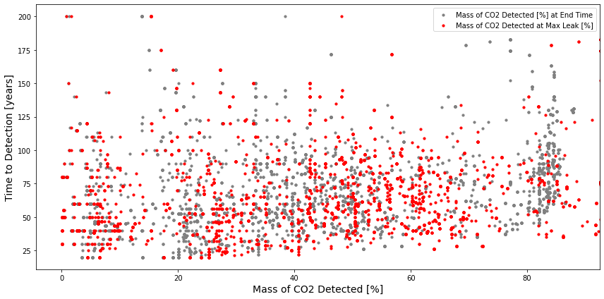

<b>
      Figure&nbsp;29: Simulated annealing example of PMCD using last time step compared to the time at which the maximum leak is detected versus TTD
      </b>

&nbsp;

<ul>
<li>PMCD &amp; PMMCD vs Monitoring Cost
<ul>
<li>Similar to (f), this dual panel view is comparing the mass of CO2 detected at the end of the monitoring campaign to the mass of CO2 detected when there is maximum saturation (i.e., largest leak detected). This figure will highlight the discrepancy in PMCD and PMMCD (e.g., Figure 30).</li>
<li>For example, it can help address if there is a large enough difference between the two, such that it is worthwhile to continue monitoring and accruing costs to capture relevant or significant leaks.</li>
<li>In Figure 30, this figure indicates that there does not appear to be a significant difference between using the last time step of the monitoring campaign or the time step at which the maximum leak is detected.</li>
</ul>
</li>
</ul>

 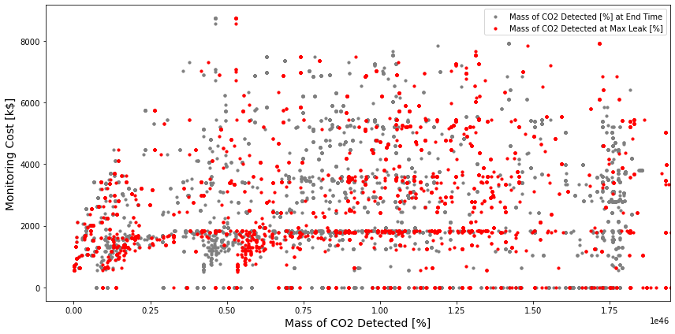

<b>
      Figure&nbsp;30: Simulated annealing example of PMCD using last time step compared to the time at which the maximum leak is detected versus Monitoring Cost
      </b>

<ul>
<li>3D scatter plots of PMCD, PLD and TTD
<ul>
<li>In these 3D scatter plots, the percent leak detection cutoff iterates through 10% to 90%, in which a smaller percent cutoff indicates that almost all leaks are included (e.g., Figure 31). A GIF (left) is produced from this set of figures to visualize the progression of smaller, more common leaks to larger, less common leaks, and how these leaks relate to TTD.</li>
<li>Questions to consider are: on average, does it take longer to detect larger leaks?</li>
<li>In Figure 31, PMCD, PLD, and TTD all increase as more leaks are detected.</li>
</ul>
</li>
</ul>

 

<b>
      Figure&nbsp;31: Simulated annealing example of 3D scatter plots that show when 0%-100% of leaks are detected for (left) PMCD, PLD and TTD and (right) PLD, TTD, and Monitoring Cost
      </b>

      

<ul>
<li>3D scatter plots of PMCD, TTD, and Monitoring Cost
<ul>
<li>Similar to (h), these 3D scatter plots look at the leak detection cutoff from 10% to 90% (e.g., Figure 31). A GIF (right) is produced from this set of figures to show the relationship for the mass (or size) of the leak in relation to how long it takes to be detected and how expensive this scenario will be.</li>
<li>Questions to consider are: how important is PMCD, and is it a good indicator with a strong relationship between TTD and monitoring cost?</li>
<li>In Figure 31, as expected, the GIF shows how PLD and TTD increase as the mass of CO2 detected increases.</li>
</ul>
</li>
</ul>

&nbsp;

<ul>
<li>3D plot showing designation of monitoring campaigns for different scenarios
<ul>
<li>This figure shows the placement of the specified monitoring technologies, e.g., gravity survey, well(s), point sensor(s), at the designated site. On the right-hand panel, the plots of PLD and Monitoring Cost versus TTD iteratively show the location of the monitoring campaign scenario on the plots as a black dot. This allows the user to visualize how a certain scenario affects these objectives.</li>
</ul>
</li>
</ul>

 

<b>
      Figure&nbsp;32: Simulated annealing example of 3D scatter plots that show (left) some of the proposed monitoring campaigns and (right) the respective PLD and Monitoring Cost versus TTD
      </b>

Figure 32: Simulated annealing example of 3D scatter plots that show (left) some of the proposed monitoring campaigns and (right) the respective PLD and Monitoring Cost versus TTD Monitoring Technologies

DREAM currently supports point sensors and surface surveys, but there are plans to expand to additional technologies. Cross-well ERT technology was once available to a limited degree but needs some additional work to fit with the new architecture of DREAM V3. There are some assumptions made about each monitoring technology that the user should be aware of.

Many of the algorithms also make small mutations to monitoring technologies between iterations, and these mutations look different depending on the technology. These mutations are intentionally as small as possible to allow the algorithms to test campaigns similar to other optimal campaigns. Details on how mutations are handled are further described for each algorithm in Section 7.

<h2>5.2&nbsp;&nbsp;&nbsp;&nbsp;&nbsp;&nbsp;&nbsp;&nbsp;&nbsp;&nbsp; Point Sensors</h2>

Point sensors occupy a single location and continuously monitor at every time step. Point sensors are only placed within the detectable plume for a given parameter, where they will detect a leak for at least one scenario. To develop optimized monitoring campaigns, point sensors typically have a delayed start until the first time at which they can detect a leak for any scenario. If a point sensor is allowed redeployments, it may be moved from one location to another at a randomly chosen timestep. Point sensors are also constrained by the maximum number of wells and minimum distance between wells, as point sensor locations are first determined. Then, well locations, depths, and costs are assessed based on point sensor locations.

The following mutations are available for point sensors:

<ul>
<li>Move an existing sensor to another valid location, searching for a valid move within 3 nodes of the original location, and then within 6 nodes, and so forth to keep changes small (60%)</li>
<li>Add a redeployment to an existing sensor, allowing it to move locations at a specified time (20%)</li>
<li>Remove a redeployment on an existing sensor, so that it remains longer at its original location (20%)</li>
</ul>
<h2>5.3&nbsp;&nbsp;&nbsp;&nbsp;&nbsp;&nbsp;&nbsp;&nbsp;&nbsp;&nbsp; Surface Surveys</h2>

Surface surveys, such as gravity surveys, are assumed to be conducted by a team at several discrete points in time, across a wide area along the surface. DREAM visualizes surveys across the top layer of nodes, though it represents actions only on the surface. All surveys are limited to be rectangular grids, with a density anywhere between every 1-3 nodes within a given rectangular grid. Since surveys typically detect change from a baseline, DREAM assumes that a survey was conducted at the start of the simulation and that the locations of the survey remain constant that the change can be seen compared to the baseline. To develop more optimized monitoring campaigns, the first survey (aside from the baseline) is fixed at the first time at which they can detect a leak for any scenario. The max number of redeployments controls how many times the survey team might conduct another survey.

The following mutations are available for surface surveys:

<ul>
<li>Add additional nodes to an existing survey, increasing its size by one additional row in either direction (30%)</li>
<li>Remove nodes from an existing survey, reducing its size by one row in either direction (30%)</li>
<li>Alter the density spacing on an existing survey, which can alter the survey to be every node, every other node, or every third node (20%)</li>
<li>Add an additional survey redeployment to an existing survey (10%)</li>
<li>Remove a survey redeployment from an existing survey (10%)</li>
</ul>

&nbsp;

<h1>6.&nbsp;&nbsp;&nbsp;&nbsp; Optimization Algorithms</h1>

DREAM is intentionally designed to run on a personal computer. Therefore, a complete enumeration of the solution space that tests all possible combinations and placements of monitoring technologies is not feasible. As an alternative, DREAM uses various optimization algorithms to approximate the optimal monitoring campaigns. Because multiple objectives are considered, there will be many optimal monitoring campaigns each with unique trade-offs between the objectives.

The algorithms are built into DREAM such that the user can easily select any of the following algorithms and simply compare results from one run to the next. However, a basic understanding of the algorithms can help decide which option suites a particular leak ensemble. Number of scenarios, size of domain, and degree of variation between scenarios can all factor into which algorithm may perform the best for each leak ensemble.

<h2>6.1&nbsp;&nbsp;&nbsp;&nbsp;&nbsp;&nbsp;&nbsp;&nbsp;&nbsp;&nbsp; Monte Carlo</h2>

Monte Carlo essentially uses randomization to seek optimal numerical results. Each iteration is a randomly created campaign and has no bearing on the next iteration, i.e., an independent draw of a campaign for each iteration. Every random campaign only considers placing monitoring technology in locations where it may detect a leak for at least one scenario, known as the detectable plume. If the user determines a more restrictive detection criteria (Section 3.5), it is possible that the random campaign results in no detection, but otherwise, most campaigns should offer some benefit.

The main advantage of Monte Carlo is that it is very fast to run iterations. Monte Carlo also widely explores the solution space, giving a full spectrum of possible solutions and their objective values. However, Monte Carlo does not explore the optimal solution space well, is computationally expensive, especially for a large solution space. Therefore, it is not recommended to be anything more than a diagnostics tool.

<h2>6.2&nbsp;&nbsp;&nbsp;&nbsp;&nbsp;&nbsp;&nbsp;&nbsp;&nbsp;&nbsp; Simulated Annealing</h2>

Simulated annealing is the default algorithm for DREAM that was founded by Matott et al. (2011) to perform moderately well among evaluated algorithms for geoscience applications, and it was first developed by Bangerth et al. (2006) to be efficient at finding near-optimal solutions. Simulated annealing is an iterative search heuristic analogous to the physical process of annealing. At each iteration, the campaign is randomly mutated with one of the following actions, listing the probability that each action will be selected:

<ul>
<li>Add a random monitoring technology to a valid location (10% chance)</li>
<li>Remove an existing monitoring technology (10% chance)</li>
<li>Modify an existing monitoring technology (80% chance), which varies depending on the deployment method and is specified for point sensors (1) and surface surveys (6.2).</li>
</ul>

Each of the listed actions are limited by user-defined constraints, such as the range of monitoring technologies allowed, the range of available survey sizes, and budget constraints. The probabilities determine which action is selected. If one action is attempted and fails due to constraints (e.g., add a location when no budget is available), a new action is randomly selected until an action is successful.

Simulated annealing comes into play as the algorithm decides whether to keep the previous campaign or the mutated campaign at each iteration. Each new iteration is compared with the previous best iteration based on performance for the selected objectives. However, simply taking the better campaign every time is likely to trap the algorithm at a locally optimized result rather than the globally optimized result. Therefore, DREAM will occasionally continue with the objectively worse campaign based on a cooling function.

The cooling function determines a degradation from 1 to 0 across the iterations, with the default as exponential decay (Figure 33). As the value is &ldquo;hot&rdquo;, (closer to 1) it is more likely to keep the worse campaign, but as the value &ldquo;cools&rdquo;, (closer to 0) it is more likely to keep the better campaign. This allows the algorithm to act risky towards the start of the run and transition towards more stable changes as the solution converges on an optimized location at the end of the run. The best campaigns are saved during the entire process.

The cooling function is &nbsp;by default, where &nbsp;is the current iterate and &nbsp;is the total number of allotted iterations. As the algorithm reaches the end, i.e., , the cooling function &nbsp;will approach 0.01; in other words, it will be inclined to choosing better campaigns.&nbsp; If the user would like to adjust or change the cooling function, the two variables, &nbsp;and , can be manipulated to create a new cooling function that differs from the default. However, it must behave in such a way that it has a range between 0 and 1, and as the simulated annealing algorithm progresses, it must eventually &ldquo;cool&rdquo; down close to 0 as .

 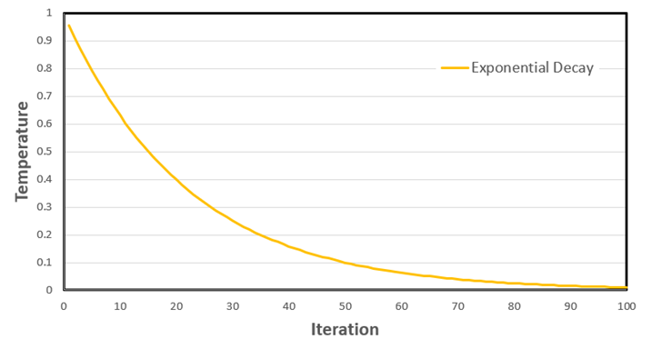

<b>
      Figure&nbsp;33: Exponential decay used for temperature function
      </b>

&nbsp;

<h2>6.3&nbsp;&nbsp;&nbsp;&nbsp;&nbsp;&nbsp;&nbsp;&nbsp;&nbsp;&nbsp; Heuristic Algorithm</h2>

The DREAM heuristic algorithm is a novel approach for examining the set of undetected, detectable leaks, and identifies the spaces where they spatially overlap (Figure 34). It then generates a cumulative distribution function (Figure 35) based on the number of overlapping leaks that are predicted by a single monitoring plan with different sensor technology schemes, and preferentially assigns sensors to the spaces where the greatest number of possible leaks would be detected. Each time a new sensor is added to the monitoring plan, the set of overlaps and the cumulative distribution function are re-computed. This algorithm considers only the detectable leaks, meaning that the monitoring technology being added to the monitoring plan could detect the magnitude of the physical signal produced by the leak. Where multiple monitoring technologies are being considered, the algorithm cycles through the list and considers one monitoring technology at a time.

 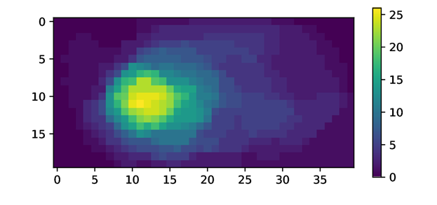

<b>
      Figure&nbsp;34: The variability and intensity of color in the colormap indicates the number of leaks that overlap at each point (x,y), considering only the leaks that are detectable but as-yet undetected by the given monitoring plan.
      </b>

&nbsp;

 

<b>
      Figure&nbsp;35: Each node number corresponds to a pixel from Figure 34, and the rise in the corresponding CDF value is proportional to the number of leaks that are detectable at that node location.
      </b>

&nbsp;

<h1>&nbsp;</h1>
<h1>7.&nbsp;&nbsp;&nbsp;&nbsp; Appendix</h1>
<h2>7.1&nbsp;&nbsp;&nbsp;&nbsp;&nbsp;&nbsp;&nbsp;&nbsp;&nbsp;&nbsp; Objectives</h2>

Objectives are assessed in Run DREAM, and there is a minimum of two objectives that must be assessed. These objectives may feed back into some algorithms at each iteration, though. The following objectives are available&nbsp;:

Time to Detection &ndash; A required objective; this determines how much time passes until the deployed technology detects a leak. DREAM considers a shorter time to detection to be preferable.

<ul>
<li>Cost &ndash; This objective includes the cost of each technology and well costs for the campaign. Using equations on the cost fields can allow for both capital and operating costs. DREAM considers lower costs to be preferable.</li>
<li>VAD at Detection &ndash; Tied to the first objective, this calculates the volume of aquifer degraded at the time when the leak is first detected, representing the magnitude of the leak. DREAM considers lower volumes to be preferable.</li>
<li>Scenarios Detected &ndash; Tied to the first objective, this calculates the percent of scenarios that are detected with a given monitoring campaign.</li>
</ul>
<h2>7.2&nbsp;&nbsp;&nbsp;&nbsp;&nbsp;&nbsp;&nbsp;&nbsp;&nbsp;&nbsp; Pointers for Running Dream</h2>

In this section, we will go over some important pointers when using DREAM to ease the difficulty in setting up a DREAM run. Throughout DREAM, there will be question marks above some of the features that you can click on for more helpful information. If you click on one of these questions marks, you can learn about what inputs are required, description of the feature, and much more.

 

<b>
      Figure&nbsp;36: Example of question marks that you can click on for more information
      </b>

<strong>Runtime Considerations</strong>

<ul>
<li>Be mindful of the number of model nodes specified in the HDF5 or IAM files. Many nodes will shoot up runtime.</li>
<li>Having either many nodes, wells, and/or sensors will significantly increase runtime. Including many wells and sensors will increase the search space by increasing the possible combinations for sensor type and sensor locations. Using more iterations will increase runtime either significantly or mildly depending on the algorithm.</li>
<li>Relative change will always be a percent value regardless of the units of the parameter</li>
<li>Negative values and ranges for parameter values are currently not allowed?</li>
<li>When choosing the number of iterations for the optimization algorithm be aware that
<ul>
<li>Grid Search will quickly become computationally intractable</li>
<li>Monte Carlo will also become computationally expensive searching through a large decision space</li>
<li>Simulated Annealing, Heuristic, and NSGA-II algorithms are better equipped for searching large decision space, but runtime will still increase</li>
</ul>
</li>
</ul>

<strong><em>Scenario Weighting</em></strong>

<ul>
<li>In general, it is sufficient to stick with equal weighting of all scenarios. The default setting is okay to use.</li>
<li>It is advised to limit how many scenarios are unselected under <em>Scenario</em>. This can introduce bias into the results from the DREAM optimization algorithm, e.g., only selecting simulations when there are detected leaks may be tempting. However, this will introduce bias into the solution for optimal monitoring campaign scenarios.</li>
<li>The <em>Variable A (a) </em>and <em>Variable B (b) </em>can represent any variable of interest, e.g., user-define probability and remediation cost.</li>
</ul>

<strong><em>Exclude Locations</em></strong>

<ul>
<li>In general, it is sufficient to have all nodes selected to run in the model.</li>
<li>It may be tempting to only select scenarios where a leak is detected, but this will introduce bias into the solution for optimal monitoring campaign scenarios.</li>
</ul>

<strong><em>Monitoring Campaign Settings</em></strong>

<ul>
<li>Although it is okay to specify a monitoring budget, it is best to allow the optimization algorithm to have full range when finding the optimal monitoring campaign scenario and not limit possible scenarios. That way, the user can view all possible solutions and make informed decisions about budget afterwards.</li>
<li>It may be tempting to only select scenarios where a leak is detected, but this will introduce bias into the solution for optimal monitoring campaign scenarios. Unless</li>
</ul>

<strong><em>Detection Criteria</em></strong>

<ul>
<li>The user has free range on how many criteria to specify for leak detection.</li>
<li>&ldquo;Any Technology&rdquo; is a wildcard, meaning any sensor specified on the <strong><em>Detection Threshold</em></strong> page exceeding the user-defined value for <em>Minimum Detections to Signify Leak </em>will confidently indicate a leak has occurred.</li>
<li>The only sensors that can be used to signify a leak must have been defined on the <strong><em>Detection Threshold</em></strong></li>
</ul>

<strong><em>Detection Threshold</em></strong>

<ul>
<li>This page is different from the <strong><em>Leak Definition</em></strong> The potential leak space does not indicate a detectable leak. The thresholds and criteria specified on this page and the following are what determine if there is a detectable leak(s).</li>
<li>Under <em>Cost</em>, a cost function can be created for each monitoring technology with any of the variables, e.g., <em>t, i, s, a</em>.</li>
<li>Make sure detectable nodes for each sensor covers a reasonable amount of nodes in the model space, e.g., should be greater than 0 but it should not necessarily cover all nodes. If there are zero detectable nodes, then no leak is detected. If all nodes are covered, then it means the entire model space is covered by a leak, which might not be realistic.</li>
</ul>

<strong><em>Leak Definition</em></strong>

<ul>
<li>Only saturation and pressure can define the leak space nodes.</li>
<li>There must be at least one node found when calculating the leak space in order to proceed; otherwise, the <em>Leak Value</em> needs to be decreased, especially if there are only a few nodes covering the leak space.</li>
<li>If the user-defined threshold is exceeded, this does not necessarily mean a leak has been detected. This section is mainly for calculating VAD by finding nodes that indicate part of the aquifer has been degraded.</li>
</ul>

<strong>Additional Information</strong>

<ul>
<li>If you click on the question marks above the features, the <em>Help Viewer</em> will provide additional information. For example, under <em>Scenario Weighting</em>, the user can hover over the question mark on <em>Variable A</em> and <em>Variable B</em> and click to read more about the description and requirements (Figure 37). Or, the user can sometimes hover over the value box for a description.</li>
</ul>

 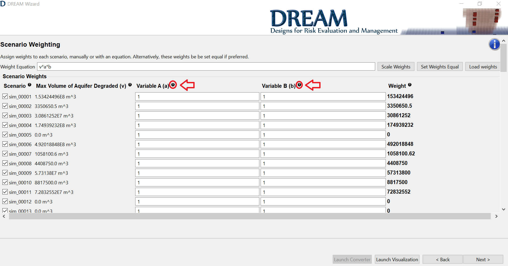     
 
    

<b>
      Figure&nbsp;37: Example of the <strong><em>Help Viewer</em></strong> in DREAM
      </b>

&nbsp;

<h1></h1>
<h1>8.&nbsp; &nbsp; &nbsp;References</h1>

Bacon, D.H.; Yonkofski, C.M.; Brown, C.F.; Demirkanli, D.I.; Whiting, J.M. (2019). Risk-based post injection site care and monitoring for commercial-scale carbon storage: Reevaluation of the FutureGen 2.0 site using NRAP-Open-IAM and DREAM. <em>Intl. J. Greenhouse Gas Control</em>, 90, 102784.

Carroll, S. A.; Keating, E.; Mansoor, K.; Dai, Z.; Sun, Y.; Trainor-Guitton, W.; Brown, C.; Bacon, D. (2014a). Key factors for determining groundwater impacts due to leakage from geologic carbon sequestration reservoirs. <em>Intl. J. Greenhouse Gas Control</em>, 29, 153&ndash;168.

Carroll, S. A.; Mansoor, K.; Sun, Y. (2014b). <em>Second</em>-<em>Generation Reduced-Order Model for Calculating Groundwater Impacts as a Function of pH, Total Dissolved Solids, and Trace Metal Concentration</em>; NRAP-TRS-III-002-2014; NRAP Technical Report Series; U.S. Department of Energy, National Energy Technology Laboratory: Morgantown, WV<em>,</em> p 40.

Last, G. V.; Murray, C. J.; Brown, C. F.; Jordan, P. D.; Sharma, M. (2013). <em>No-Impact Threshold Values for NRAP&rsquo;s Reduced Order Models</em>; Pacific Northwest National Laboratory, Richland, Washington, p.72.

Nitao, J. J. (1998). <em>Reference manual for the NUFT flow and transport code, version 2.0</em>; Lawrence Livermore National Laboratory, Livermore, CA.

Sminchak, J. R.; Moody, M.; Theodos, A.; Larsen, G.; Gupta, N. (2014). Investigation of Wellbore Integrity Factors in Historical Oil and gas Wells for CO2 Geosequestration in the Midwestern US. <em>Energy Procedia</em>, 63, 5787-5797.

White, M. D.; Oostrom M. (2000). <em>STOMP, Subsurface transport over multiple phases, Version 2.0, Theory Guide</em>; Pacific Northwest National Laboratory, Richland, WA.

Yonkofski, C. M.; Gastelum, J. A.; Porter, E. A.; Rodriguez, L. R.; Bacon, D. H.; Brown, C. F. (2016). An optimization approach to design monitoring schemes for CO2 leakage detection. <em>Intl. J. Greenhouse Gas Control</em>, 47, 233&ndash;239.

Yonkofski C.; Davidson, C.L.; Rodriguez, L.R.; Porter, E.A.; Bender, S.R.; Brown, C.F. (2017). Optimized, budget-constrained monitoring well placement using DREAM. <em>Energy Procedia</em>, 114, 3649-3655.

<h1>&nbsp;</h1>

&nbsp;

&nbsp;

&nbsp;

&nbsp;

" style="width: 79.85pt; height: 36.45pt;" alt="image">

<strong> &nbsp;</strong>

<strong>&nbsp;</strong>

<strong>&nbsp;</strong>

<strong>Sean Plasynski</strong>

Executive Director

Technology Development and Integration Center

National Energy Technology Laboratory

U.S. Department of Energy

&nbsp;

<strong>Heather Quedenfeld</strong>

Associate Director

Coal Development and Integration

National Energy Technology Laboratory

U.S. Department of Energy

&nbsp;

<strong>Traci Rodosta</strong>

Technology Manager

Strategic Planning

Science and Technology Strategic Plans and Programs

National Energy Technology Laboratory

U.S. Department of Energy

<strong>&nbsp;</strong>

<strong>Mark Ackiewicz</strong>

Director

Division of Carbon Capture and Storage

Office of Fossil Energy

U.S. Department of Energy

<strong>&nbsp;</strong>

<strong><em> &nbsp;</em></strong>

<strong><em>&nbsp;</em></strong>

<strong><em>&nbsp;</em></strong>

<strong><em>NRAP Executive Committee</em></strong>

<strong>&nbsp;</strong>

<strong>Cynthia Powell</strong>

Executive Director

Research and Innovation Center

National Energy Technology Laboratory

<strong>&nbsp;</strong>

<strong>Donald DePaolo</strong>

Associate Laboratory Director

Energy and Environmental Sciences

Lawrence Berkeley National Laboratory

<strong>&nbsp;</strong>

<strong>Roger Aines</strong>

Chief Energy Technologist

Lawrence Livermore National Laboratory

<strong>&nbsp;</strong>

<strong>Melissa Fox</strong>

Program Manager

Applied Energy Programs

Los Alamos National Laboratory

<strong>&nbsp;</strong>

<strong>George Guthrie</strong>

Chair, NRAP Executive Committee

Earth and Environmental Sciences

Los Alamos National Laboratory

<strong>&nbsp;</strong>

<strong>Alain Bonneville</strong>

Laboratory Fellow

Pacific Northwest National Laboratory

<strong>&nbsp;</strong>

<strong>Grant Bromhal</strong>

Technical Director, NRAP

Senior Research Fellow&nbsp;

Research and Innovation Center

National Energy Technology Laboratory&nbsp;

&nbsp;

<em>&nbsp;</em>

NRAP is an initiative within DOE&rsquo;s Office of Fossil Energy and is led by the National Energy Technology Laboratory (NETL). It is a multi-national-lab effort that leverages broad technical capabilities across the DOE complex to develop an integrated science base that can be applied to risk assessment for long-term storage of carbon dioxide (CO2). NRAP involves five DOE national laboratories: NETL, Lawrence Berkeley National Laboratory (LBNL), Lawrence Livermore National Laboratory (LLNL), Los Alamos National Laboratory (LANL), and Pacific Northwest National Laboratory (PNNL).

&nbsp;

<em>Technical Leadership Team</em>

<em> &nbsp;</em>

<em>Diana Bacon</em>

Lead, Groundwater Protection Working Group

Pacific Northwest National Laboratory

Richmond, WA

<em>Jens Birkholzer</em>

LBNL Lab Lead

Lawrence Berkeley National Laboratory

Berkeley, CA

<em>Grant Bromhal</em>

Technical Director, NRAP

Research and Innovation Center&nbsp;

National Energy Technology Laboratory

Morgantown, WV

<em>Chris Brown</em>

PNNL Lab Lead

Pacific Northwest National Laboratory

Richmond, WA

<em>Susan Carroll</em>

LLNL Lab Lead

Lawrence Livermore National Laboratory

Livermore, CA

&nbsp;

<em>Abdullah Cihan</em>

Lead, Reservoir Performance Working Group

Lawrence Berkeley National Laboratory

Berkeley, CA

&nbsp;

<em>&nbsp;</em>

<em>Tom Daley</em>

Lead, Strategic Monitoring Working Group

Lawrence Berkeley National Laboratory

Berkeley, CA

<em>Robert Dilmore</em>

NETL Lab Lead

Research and Innovation Center&nbsp;

National Energy Technology Laboratory

Pittsburgh, PA

<em>Nik Huerta</em>

Lead, Migration Pathways Working Group

Research and Innovation Center&nbsp;

National Energy Technology Laboratory

Albany, OR

<em>Rajesh Pawar</em>

LANL Lab Lead

Lead, Systems/Risk Modeling Working Group

Los Alamos National Laboratory

Los Alamos, NM

<em>Tom Richard</em>

Deputy Technical Director, NRAP

The Pennsylvania State University

State College, PA

<em>Josh White</em>

Lead, Induced Seismicity Working Group

Lawrence Livermore National Laboratory

Livermore, CA

&nbsp;

 &nbsp;

 &nbsp;

&nbsp;

&nbsp;

